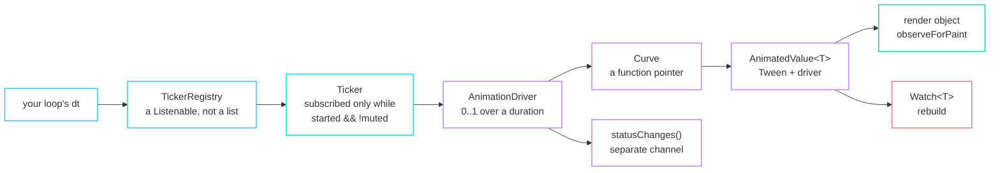

import { Aside, Card, CardGrid, Steps } from '@astrojs/starlight/components';

Animation is a first-class requirement here, not an afterthought. The assumption
is that something is animating almost always and that many things are animating
at once, which constrains everything below.



## Time is a delta you measured

There is no clock anywhere in fltr. `TickerRegistry::tick(seconds)` is called by
your loop with however long the last frame actually took.

### Divergence: the registry is a `Listenable`, not a list of tickers

Two things fall out for free:

- Starting or stopping a ticker **from inside a tick** is safe, because
  `notifyListeners` already handles a listener mutating the list.
- An unstarted ticker holds **no subscription at all**. "An animation in a hidden
  panel costs nothing" is `activeTickerCount()`, a number the tests assert, not a
  claim.

Muting is exact for the same reason time is a delta: a muted ticker resumes
exactly where it stopped, with nothing to reconcile. `TickerMode` mutes every
ticker in a subtree, which is how the walkthrough freezes the HUD behind a pause
menu.

## The driver

```cpp title="animation/driver.hpp"
struct Config { float duration = 0.2f; Curve curve; Curve reverseCurve; };

float progress() const;         // before easing
float value() const;            // after easing — what a Tween samples at
AnimationStatus status() const; // Dismissed | Forward | Reverse | Completed
Listenable& statusChanges();    // fires only at transitions, not every frame

void forward();  void reverse();
void animateTo(float target);   // retargets; does not restart
void repeat(bool pingPong = false);
void jumpTo(float progress);  void stop();
```

<Aside type="tip" title="Duration is the time for the full range">
A shorter journey takes proportionally less time — reversing from 0.3 takes 30%
of the duration. That is what makes interruption behave: pointer enter and exit
arrive mid-animation constantly, and the result has to be continuous rather than
suddenly slow.
</Aside>

`statusChanges()` is a **separate channel** from the value channel on purpose.
Logic that waits for an animation to settle should not be woken sixty times a
second to be told it has not.

## Curves are function pointers

```cpp
class Curve {
  using Fn = float (*)(float t);
  constexpr float operator()(float t) const noexcept;
};

namespace Curves {
  inline constexpr Curve linear, easeIn, easeOut, easeInOut,
                         easeInCubic, easeOutCubic, easeInOutCubic;
}
```

One pointer to copy into a widget configuration, trivially destructible, and
callable with no object in the way. A distinct `reverseCurve` is available and
**unset by default** — that is the continuous choice, because a different reverse
curve changes the value at the instant of the reversal.

There are no springs-as-curves, no `cubic-bezier(a,b,c,d)`, and no bounce or
elastic. Springs live in the simulation layer instead.

## Interpolation is a concept, not a hierarchy

```cpp
template <class T> concept Interpolatable = requires(const T& a, const T& b, float t) {
  { lerp(a, b, t) } -> std::convertible_to<T>;
};
```

Found by ordinary overload resolution. Every geometry and paint type already
satisfies it — `float`, `Offset`, `Size`, `Rect`, `EdgeInsets`, `Alignment`,
`Color`, `BorderRadius`, `Transform2D`, `BoxDecoration`, `TextStyle`. Your own
type joins by defining `lerp` beside it.

## Re-basing, not retargeting

```cpp title="animation/tween.hpp"
void AnimatedValue<T>::retarget(T to) {
  tween_ = {value_, std::move(to)};   // the new interval starts where the last actually reached
  driver_->jumpTo(0.0f);
  driver_->forward();
}
```

The new interval begins at the value **on screen**, not at the old tween's
origin. Repeated interruption therefore accumulates no error — hover in, hover
out, hover in again mid-fade, a hundred times, and the value stays continuous.

## Two paths, and the difference is the whole point

<CardGrid>
  <Card title="Cheap — render-attached" icon="rocket">
    The animated value goes **down the tree** to a render object, which
    `observeForPaint`s it. A tick invalidates one render object, rebuilds
    nothing, lays out nothing.

    `RenderOpacity::setAnimation`, `RenderTransform::setAnimation`,
    `RenderDecoratedBox::setAnimation`.
  </Card>
  <Card title="Expensive — layout-attached" icon="warning">
    `RenderPositionedBox::setAnimation` uses `observeForLayout`. Every frame lays
    out the subtree.

    `AnimatedAlign`'s own doc comment names it: *"the one whose frames are not
    free, and the reason the other three exist."*
  </Card>
</CardGrid>

| Property | Widget | Path | Per-frame cost |
|---|---|---|---|
| Opacity | `Opacity` / `AnimatedOpacity` | paint | one repaint |
| Transform | `Transform` / `AnimatedTransform` | paint | one repaint |
| Decoration | `DecoratedBox` / `AnimatedDecoration` | paint | one repaint |
| Alignment | `Align` / `AnimatedAlign` | **layout** | relayout of the subtree |
| Anything textual | `Watch` + a rebuild | build | rebuild + layout + paint |

## Implicit animations

```cpp
AnimatedOpacity::make({
  .opacity = hovered ? 1.0f : 0.35f,
  .animation = {.duration = 0.12f, .curve = Curves::easeOut},
  .child = badge(),
})
```

Changing the configuration re-targets the interpolation from the value on screen
and runs the driver from zero. **Only the configuration change rebuilds** — every
tick after it invalidates exactly one render object, because what the built
widget hands down is the animated value itself rather than a snapshot of it.

<Aside type="caution" title="They do not animate on first build">
`initState` sets the tween to `{target, target}`, so an implicitly animated
widget appears already settled. Animating something *in* is `AnimatedSwitcher`'s
job, not an implicit animation's.
</Aside>

A widget joins the layer by naming four things — `using Value`, `target()`,
`animation()`, and a static `compose(self, ValueListenable<Value>&)`. There is no
`forEachTween`; the animated value goes down the tree directly.

## Physics simulations

```cpp title="animation/simulation.hpp"
class Simulation {
  virtual float x(float time) const = 0;
  virtual float dx(float time) const = 0;
  virtual bool isDone(float time) const = 0;
};
```

`FrictionSimulation` (closed-form, with `finalX()` and `timeAtX()`),
`SpringSimulation` (closed-form under/critical/over-damped branches, **not**
integrated), `ClampingScrollSimulation` (Android's power law),
`BouncingScrollSimulation` (iOS: friction until it leaves the range, then a
spring).

These sit **alongside** the driver rather than replacing it: a driver is
normalised 0..1 over a duration, and a simulation is unbounded in value and
settles by tolerance. Scrolling runs on the simulations; UI transitions run on
the driver.

## Verifying animation

<Steps>

1. **Drive time explicitly.** Pass a fixed step to `drawFrame` instead of a real
   clock, and every animation becomes deterministic.

2. **Assert `activeTickerCount()`.** An animation in an unmounted or muted
   subtree should hold no subscription — the number, not the intent.

3. **Assert `buildCount()` across a tick.** A render-attached animation should
   advance with zero builds. If the number moves, something is on the rebuild
   path that did not need to be.

</Steps>
