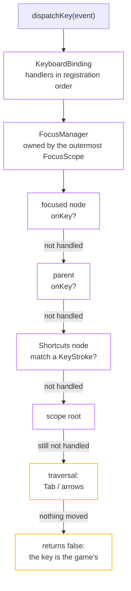

import { Aside, Steps } from '@astrojs/starlight/components';

The focus subsystem is ambient. A tree with no `FocusScope` above it holds no
focus nodes, no key handlers and no subscriptions, and
`KeyboardBinding::handlerCount()` is zero. That is what makes pointer-only a
configuration rather than a phase the design passed through.



## Divergence: one walk, not four layers

Flutter routes a key through `HardwareKeyboard`, then the focus chain, then
`Shortcuts`, then `Actions`, with an `Intent` object in between. fltr offers the
event to every node from the focused node up to the root, and traversal is what
is left when nobody took it.

**What it costs:** a shortcut is bound to its callback where it is declared, so an
ancestor cannot re-target what a descendant means by "activate". If you need
re-bindable actions, you build that indirection yourself.

## Divergence: tab order is build order

Flutter's default policy sorts nodes geometrically into reading order. fltr uses
Flutter's other policy, `WidgetOrderTraversalPolicy`, because it needs no
rectangles and works before the first layout has run.

Directional traversal, which is what a D-pad or a stick produces, does use
rectangles:

<Steps>

1. Take the focused node's rectangle in root space, via `getTransformTo`.
2. Find candidates whose centre lies beyond it in the requested direction.
3. Prefer one whose extent overlaps on the other axis. Moving right along a row of
   buttons should not jump to something diagonally below just because it happens
   to be nearer.
4. Among those, take the nearest.

</Steps>

`FocusNode::rect()` is what makes step 1 possible, and it is why
`RenderObject::getTransformTo` had to exist before this milestone could.

## The pieces

```cpp title="focus/node.hpp"
class FocusNode : public Listenable {
  void attach(FocusNode& parent);   void detach();
  void setCanRequestFocus(bool);        // can this ever hold focus?
  void setSkipTraversal(bool);          // reachable by Tab / arrows?
  void setDescendantsAreFocusable(bool);
  bool requestFocus();   void unfocus();
  Rect rect() const;                    // root space, for directional traversal
  Callback<bool(const KeyEvent&)> onKey; // public data member
};

class FocusScopeNode final : public FocusNode {
  FocusNode* focusedChild() const;      // remembers where focus was
  void setTabTraversal(bool);
  void setDirectionalTraversal(bool);
};
```

<Aside type="note" title="Divergence: the scope is the traversal group">
Flutter separates `FocusScope` from `FocusTraversalGroup`. Here they are one
object. **What it costs:** a traversal group that is not also a focus scope is not
expressible, so "these five buttons wrap around among themselves but share the
enclosing scope's focus memory" cannot be written.
</Aside>

## Widgets

| Widget | Role |
|---|---|
| `FocusScope` | Brings the subsystem into existence; owns the `FocusManager`. Put one near the root. |
| `Focus` | One focusable node. `autofocus`, `onKey`, `onFocusChange`, and `ensureVisible` so focusing something inside a scrollable scrolls it into view. |
| `FocusMarker` | The ambient value that publishes the current node downwards; `FocusMarker::of(context)` is null when there is no focus tree. |
| `Shortcuts` | A focus node that never takes focus, so keys reach it on the way up. Holds a `ShortcutList` of `KeyStroke` → `Callback<void()>`. |

A `KeyStroke` matches exactly: Ctrl-S is not Ctrl-Shift-S, the same rule
Flutter's `SingleActivator` follows.

```cpp
Shortcuts::make({
  .shortcuts = {
    {.stroke = KeyStroke{.key = LogicalKey::Escape},    .onInvoke = [&] { app.togglePause(); }},
    {.stroke = KeyStroke{.key = LogicalKey::Backspace}, .onInvoke = [&] { app.goBack(); }},
  },
  .child = screen,
})
```

The braced list is a temporary, so entries are copied into the build arena and
then copied again into the `State` when the configuration is adopted. A key
arrives long after that arena was released.

## Physical versus logical keys

```cpp
struct KeyEvent {
  KeyEventType type;      // Down | Up | Repeat
  PhysicalKey physical;   // where it is on the keyboard: WASD stays under the same fingers
  LogicalKey logical;     // what it means under the active layout: what a shortcut binds to
  KeyModifiers modifiers;
  char32_t character = 0; // reported by you, never derived
};
```

Movement binds to `physical`. Shortcuts bind to `logical`. The character is
reported rather than derived, because layout and IME both live on your side.

## Two objects that know each other

A `FocusNode` may be owned by the `State` that created it, or supplied by the
consumer. `OwnedFocusNode` handles both, and uses a `Subscription` as a liveness
token: if a consumer destroys a node while a component still names it, the
component reads it as gone rather than dangling.

```cpp
// Null once a consumer-supplied node has been destroyed.
Node* get() const noexcept;
```

The same pattern appears for `WidgetStatesController`, `ScrollController` and
`AnchorLink`. It is the closest thing fltr has to a weak pointer, and it costs two
pointer stores.

## Components get keyboard activation for free

Focus landed before the component layer, which is why every `RawButton`,
`RawToggle` and `RawSlider` has keyboard activation, a focus state in its
published `WidgetStates`, and gamepad navigation designed in rather than
retrofitted. Turning all of it off is one flag rather than a different widget:

```cpp
RawButton::make({
  .canRequestFocus = false,   // never holds focus
  .skipTraversal = true,      // never reached by Tab or a D-pad
  .child = ...,
})
```
