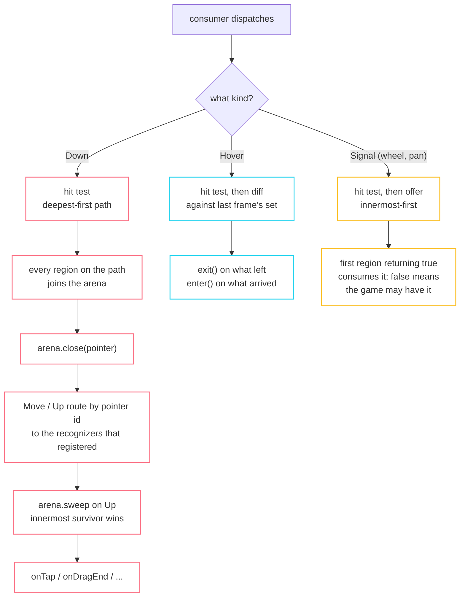

import { Aside, Steps } from '@astrojs/starlight/components';

There are three separate paths through the input layer and they share almost
nothing. Each has a different answer to "what is under the pointer" and a
different idea of when to ask.



## Hit testing

```cpp title="render/hit_test.hpp"
struct HitTestEntry { RenderBox* target; Offset localPosition; };

class HitTestResult {
  void add(RenderBox* target, Offset localPosition);
  bool addWithPaintOffset(Offset offset, Offset position, FunctionRef<bool(HitTestResult&, Offset)>);
  bool addWithPaintTransform(const Transform2D&, Offset, FunctionRef<bool(HitTestResult&, Offset)>);
  std::span<const HitTestEntry> path() const;   // deepest (topmost) first
};
```

Children are tested in **reverse** order, so the topmost wins. `HitTestBehavior`
decides what a region does with a hit that its child already claimed:

| Behaviour | Adds itself | Blocks what is behind |
|---|---|---|
| `DeferToChild` | only if a child was hit | only if a child was hit |
| `Opaque` | always | always |
| `Translucent` | always | no |

<Aside type="note" title="Divergence: entries record positions, not transforms">
Flutter stores a full global→local transform per entry. fltr stores the
already-resolved local position, which keeps `HitTestEntry` trivially copyable.

**What it costs:** an entry cannot be re-projected afterwards. In practice this
bites in one place: a drag inside a rotated subtree cannot convert its global
delta into a local one.
</Aside>

## Divergence: routes, not a cached path

Flutter caches the hit path at pointer-down and dispatches every later event
along it. fltr hit-tests only on `Down` (and on `Hover`, for the mouse), then
routes everything afterwards by pointer id to the recognizers that registered for
it.

Two reasons, both about lifetime:

1. A cached path is a list of raw render-object pointers held across frames, and
   a rebuild in the middle of a gesture can destroy one of them.
2. A recognizer must keep receiving events after the pointer has left the region
   it started in. A drag that wanders off the slider still belongs to the slider.

**What it costs:** a render object cannot receive raw move/up events without
owning a recognizer. There is no "just tell me about every event here".

## The arena

Overlapping interactive regions have to resolve to exactly one winner, and the
answer cannot simply be "the innermost", because a drag inside a scrollable
should beat a tap on the row it started on.

<Steps>

1. **Members join on `Down`,** deepest-first, as the event travels the hit path.
   Each `RenderPointerRegion` offers whatever recognizers its callbacks imply.

2. **`close(pointer)` runs immediately after.** If only one member joined it wins
   right there, so the common case costs nothing.

3. **Members resolve as they learn.** A tap recognizer rejects itself the moment
   the pointer moves past the slop; a drag accepts itself at the same instant.

4. **`sweep(pointer)` on `Up`** awards the first member still standing, which is
   the innermost one that never gave up.

5. **`hold` / `release`** defer the sweep. A double-tap recognizer holds the arena
   while it waits for the second tap.

</Steps>

Storage is one flat list shared across all pointers, with entries nulled rather
than erased so that a resolution already in flight keeps its indices valid.

<Aside type="caution" title="remove() awards nothing">
When a member is removed, which happens because its render object is being
destroyed, the arena does not promote the next candidate. Firing a game callback
out of a destructor is worse than dropping the gesture.
</Aside>

## Recognizers are created on demand

`RenderPointerRegion::syncRecognizer` creates a recognizer only when a callback
wants one. A hover-only region holds zero, and the test suite asserts on
`recognizerCount()`.

| Recognizer | Created by | Notable |
|---|---|---|
| `TapGestureRecognizer` | `onTap`, `onTapDown`, `onTapCancel` | `onTapDown` fires when the recognizer wins, not on pointer-down |
| `DoubleTapGestureRecognizer` | `onDoubleTap` | holds the arena between taps |
| `LongPressGestureRecognizer` | `onLongPress` and friends | start / move-update / end details |
| `DragGestureRecognizer` | `onDragStart` and friends | one class with a `DragAxis`, not three |

Slop and timing constants live in `gestures/constants.hpp`: `kTouchSlop = 18`,
`kPanSlop = 36`, `kLongPressTimeout = 0.5`, `kDoubleTapTimeout = 0.3`,
`kDoubleTapSlop = 100`.

### Velocity is fitted, not differenced

`VelocityTracker` does a least-squares quadratic fit over a 0.1-second sample
window. Differencing the last two positions gives a number that jitters with the
event rate; the fit gives one a fling can be built on.

## Time enters through the frame

`PointerEvent` has no timestamp. Instead:

```cpp
void PointerBinding::advanceTime(float seconds);
void scheduleTimeout(GestureRecognizer&, PointerId, float delay);
```

Due deadlines are removed from the list before any of them fires, so a callback
that schedules another timeout cannot have it fire in the same pass. The list is
kept sorted with an insertion sort rather than the library sort, which allocates
a temporary buffer.

## Hover is a diff, not a gesture

`MouseTracker` builds the newly-hovered set, swaps it in before any callback runs,
then fires `exit()` on what left and `enter()` on what arrived. In that order, a
callback that rebuilds the tree cannot corrupt the iteration.

- Only mouse pointers hover. Touch never produces enter/exit.
- `settleHover` re-resolves once per frame and does nothing at all when nothing
  moved and nothing laid out.
- `resolveCursor` walks deepest-first and takes the innermost non-`Defer`
  opinion, which is what `WidgetBinding::cursor()` returns.

## Signals never enter the arena

```cpp
bool WidgetBinding::dispatchSignal(const PointerSignalEvent& event);
```

A wheel notch or trackpad pan is offered to each region innermost-first until one
returns `true`. There is no contest and no deferral, which is what a browser does
when a scrolled-to-the-end list lets the page scroll instead.

`false` means no UI wanted it, so your game may zoom the camera with it.
`dispatchKey` answers the same question for keys, and the walkthrough uses both to
hand the ship its controls back when a menu closes.
