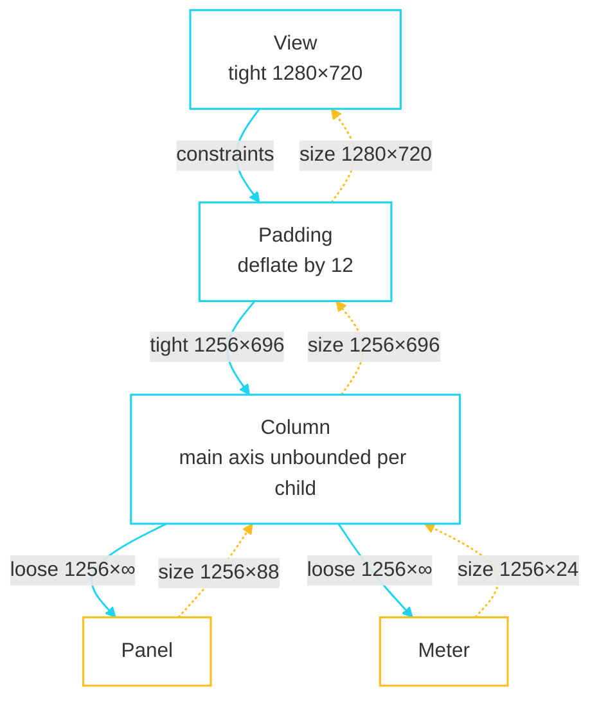

import { Aside, Steps, Tabs, TabItem } from '@astrojs/starlight/components';

Layout in fltr is one downward pass with one value going each way. A parent hands
a child a `BoxConstraints`; the child answers with a `Size`. A child never sees
its parent's size, and nothing iterates to a fixed point.



Solid edges carry constraints down; dashed edges carry sizes back up. Nothing
travels sideways, and nothing is asked twice.

## The protocol

```cpp title="render/box.hpp"
// The only entry point. `parentUsesSize` is a promise, not a hint.
void layout(BoxConstraints constraints, bool parentUsesSize = false);

// Called only when sizedByParent(); may NOT lay out children.
virtual void performResize();

// Lay out children, then setSize().
virtual void performLayout() = 0;

// The two ways to lay out a child, and the difference matters:
static void layoutChild(RenderBox& child, BoxConstraints c);         // won't read the size
static Size layoutChildForSize(RenderBox& child, BoxConstraints c);  // will read the size
```

`setSize` traps a size that violates the incoming constraints, and traps being
called outside this object's own layout. Both are the kind of bug that is nearly
invisible at runtime and obvious the moment something asserts.

## Relayout boundaries

This is the mechanism that makes update cost proportional to the dirty set rather
than to the tree.

A node is a **relayout boundary** when its size cannot change without its
parent's constraints changing first. That is true in three cases:

- the parent passed `parentUsesSize = false` — it has already committed to not
  caring;
- the incoming constraints are tight — there is only one legal size;
- the node is `sizedByParent()` — its size is a function of constraints alone.

```cpp title="src/render_object.cpp"
void RenderObject::markNeedsLayout() {
  if (needsLayout_) return;
  FLTR_EXPECTS(!owner_ || owner_->phase() != PipelinePhase::Paint,
               "painting must not dirty layout");
  needsLayout_ = true;
  if (relayoutBoundary_ == 1 || parent_ == nullptr) {
    if (owner_) owner_->nodesNeedingLayout_.push_back(this);   // the walk stops here
  } else {
    markParentNeedsLayout();
  }
}
```

`relayoutBoundary_` is a tri-state (`-1` unknown, `0` no, `1` yes) recomputed
during layout, so the answer is correct before it is ever consulted.

<Aside type="tip" title="How to get more boundaries">
Wrap a subtree whose size you already know in a `SizedBox` or a tight
`ConstrainedBox`. Tight constraints make it a boundary, so anything dirtying
inside it stops there. The [first frame](/fltr/getting-started/first-frame/)
example is annotated `[relayout-boundary]` on almost every node for exactly this
reason.
</Aside>

## Flex, in two passes

`RenderFlex` is Flutter's algorithm, and it is linear:

<Steps>

1. **Size the inflexible children.** Everything with `flex == 0` is laid out under
   `childConstraints(0, kInf)` on the main axis. Now the free space is known.

2. **Divide what is left.** Each flexible child gets `freeSpace * flex /
   totalFlex`. The **last** flexible child absorbs the rounding remainder — when
   `remainingFlex == d.flex`, its extent is simply `remainingSpace` — so children
   exactly fill the row instead of leaving a sub-pixel gap.

</Steps>

Then main-axis alignment computes a leading offset and a between-children gap,
and cross-axis alignment computes each child's cross offset.

| Situation | What happens |
|---|---|
| Cross axis unbounded and `CrossAxisAlignment::Stretch` | Degrades to loose — there is nothing to stretch to |
| Main axis unbounded (`canFlex == false`) | Flexible children behave as inflexible; nothing can be a share of infinity |
| `MainAxisSize::Min` | The flex sizes itself to its children rather than to its constraints |

## Constraints, in practice

<Tabs>
  <TabItem label="Tight">
```cpp
BoxConstraints::tight({120, 40})     // exactly this size
BoxConstraints::tightFor(120, 40)    // the same thing
SizedBox::make({.size = {120, 40}})  // the widget for it
```
Tight constraints make the child a relayout boundary.
  </TabItem>
  <TabItem label="Loose">
```cpp
BoxConstraints::loose({120, 40})   // at most this, may be smaller
constraints.loosen()               // drop the minimums
```
  </TabItem>
  <TabItem label="Unbounded">
```cpp
BoxConstraints::unbounded()        // 0..inf on both axes
BoxConstraints{.maxWidth = 560}    // bounded one way only
```
A `Scrollable` lays its child out with the scroll axis unbounded — which is why
a `Column` inside one must not itself be unbounded on that axis.
  </TabItem>
  <TabItem label="Combining">
```cpp
outer.deflate(EdgeInsets::all(12))  // what Padding does
inner.enforce(outer)                // clamp inner into outer's range
additional.enforce(constraints)     // what ConstrainedBox does
```
  </TabItem>
</Tabs>

## Divergence: `Constraints` stayed monomorphic

Flutter has a polymorphic `Constraints` base so that slivers can define their own
protocol. fltr has exactly one, `BoxConstraints`, passed by value.

**What it costs:** adopting the full sliver protocol later would mean making
constraints polymorphic, which touches every `performLayout` in the tree. That is
the recorded price of not having lazy, pinned or floating scroll children — see
[scrolling](/fltr/architecture/scrolling/).

## What is missing

There are no **intrinsic sizing** queries (`getMinIntrinsicWidth` and friends),
and no `LayoutBuilder`, so a child cannot ask how much room it ended up with.
Both are known gaps rather than decisions:

- Intrinsics are `O(n²)` in the worst case, which is why Flutter documents them
  as expensive; they are needed for table column sizing and `IntrinsicWidth`.
- `LayoutBuilder` needs building during layout, which needs an explicit,
  scoped exemption from phase separation and the build arena staying open across
  the layout phase.

The walkthrough hits the second one and works around it with a fixed width; see
[gaps and rework](/fltr/project/gaps-and-rework/).
