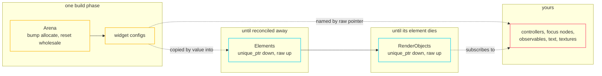

import { Aside, Card, CardGrid } from '@astrojs/starlight/components';

There is no tracing garbage collector, no shared ownership in the hot path, and
no per-frame heap allocation in the steady state. Those three constraints shape
almost every API in fltr, and this page is the single place they are collected.

## Three lifetimes



## The arena

```cpp title="core/arena.hpp"
template <class T, class... Args> T* create(Args&&...);        // static_asserts trivially destructible
template <class T, class... Args> T* createOwning(Args&&...);  // registers a destructor
void reset();                                                  // rewind + bump a generation
```

`reset()` rewinds to the first chunk and increments a generation counter — a
pointer store and an increment. Chunks are **retained**, so once the tree has
built once, building it again allocates nothing.

The generation counter is what makes `WidgetRef::stale()` work: a ref records the
generation it was created in, and comparing it to the current one is how the
framework knows whether the memory behind the pointer is still what it was.

## The rule

> **Anything a widget names by pointer is consumer-owned and must outlive the
> widget.**

This is not a style guideline; it is the memory model. The list is finite and
worth memorising:

| Type | Typically owned by |
|---|---|
| `ScrollController` | your `State`, or your app |
| `FocusNode`, `FocusScopeNode` | your `State`, or nothing (fltr makes one) |
| `WidgetStatesController` | your `State`, or nothing |
| `AnchorLink` | whatever shows the anchored thing |
| `OverlayEntry` | whatever shows it |
| `ValueListenable<T>*` (every `animation` field) | your `State`, or your game |
| `const ScrollPhysics*` | a shared constant |
| `TextService&` | your app, and it must outlive the binding |
| The `string_view` inside a `Text` | a literal, or a buffer your game owns |

<Aside type="danger" title="Text does not copy">
`Text::Args::text` is a `std::string_view` and it is **not** copied into the
arena. It must point at storage that outlives the build. A literal is fine; a
`std::string` you build in the builder and let go of is a use-after-free that
will usually look like garbled glyphs rather than a crash.

The walkthrough's `Session` keeps `char[16]` buffers for exactly this reason.
</Aside>

## Liveness tokens, not weak pointers

For the objects a consumer might destroy while a component still names them,
fltr uses an intrusive `Subscription` as a liveness token:

```cpp
class OwnedStates {
  void bind(WidgetStatesController* supplied);
  /// Null once a consumer-supplied controller has been destroyed.
  WidgetStatesController* get() const noexcept;
};
```

A `Subscription` unhooks itself when its `Listenable` dies, so a controller
destroyed while the component is still mounted reads as **gone** rather than
being written into. It costs two pointer stores and no allocation.

`OwnedFocusNode` does the same for focus nodes, and `ScrollController` and
`ScrollPosition` clear each other's pointer on destruction so either outliving
the other is inert.

<Aside type="caution" title="Not every path is guarded">
The liveness-token pattern covers the controllers. It does not cover a raw
`ValueListenable<T>*` handed to an `animation` field, or the string a `Text`
points at. Those are ordinary raw pointers with an ordinary raw-pointer rule.
</Aside>

## Callbacks are 32 bytes, inline

```cpp title="core/callback.hpp"
template <class R, class... Args> class Callback<R(Args...)> {
  static constexpr std::size_t kCapacity = 4 * sizeof(void*);
  template <class F> Callback(F&& f) noexcept;   // copies into inline storage
};
```

The captured state must be **trivially copyable** and fit in 32 bytes. Both are
`static_assert`s with readable messages. This keeps a `Callback` trivially
destructible and therefore arena-safe.

<CardGrid>
  <Card title="What fits" icon="approve-check">
    `[&app]`, `[this]`, `[&app, index]`, `[&app, screen]` — one or two pointers
    and a small value. This covers essentially every UI callback.
  </Card>
  <Card title="What does not" icon="error">
    A `Callback` captured inside another `Callback`: 40+ bytes nested in a 32-byte
    budget. Pass a function pointer and a `void*` owner instead, or restructure so
    the inner callback is constructed at the call site.
  </Card>
</CardGrid>

`FunctionRef<Sig>` is the non-owning sibling, used where the callee does not
outlive the call — visitors, layout callbacks, `setState`.

## No per-frame heap churn

Every drain loop in the framework uses a member scratch vector rather than a
local one — `layoutScratch_`, `paintScratch_`, `buildScratch_`, `routing_`,
`firing_`, `dispatching_`, and the hover diff's `before_` / `after_`.
`DisplayList::beginRecording` clears but retains capacity.

The test suite overrides global `operator new` and `operator delete` to count
allocations, so "a steady-state frame allocates nothing" is a number the tests
assert rather than an aspiration.

<Aside type="note" title="Even the timeout list">
Gesture timeouts are kept sorted with an insertion sort, deliberately, because
`std::sort` allocates a temporary buffer for some inputs. That is the level at
which this rule is taken seriously.
</Aside>

## Teardown order

`WidgetBinding` declares its members in the order they must be destroyed in
reverse — which is to say, deliberately:

```cpp
PointerBinding pointers_;    // outlives the tree: a region being dropped withdraws from it
KeyboardBinding keyboard_;
TickerRegistry tickers_;     // outlives the tree: a State being disposed releases its ticker
BuildOwner buildOwner_;
PipelineOwner pipeline_;
ElementPtr rootElement_;     // unmounts first
```

If you own a `TextService` and a `WidgetBinding`, the same logic applies to you:
the tree must come down before the service it acquired paragraphs from. The
walkthrough's `App` destructor does this explicitly rather than relying on
declaration order across two headers.
