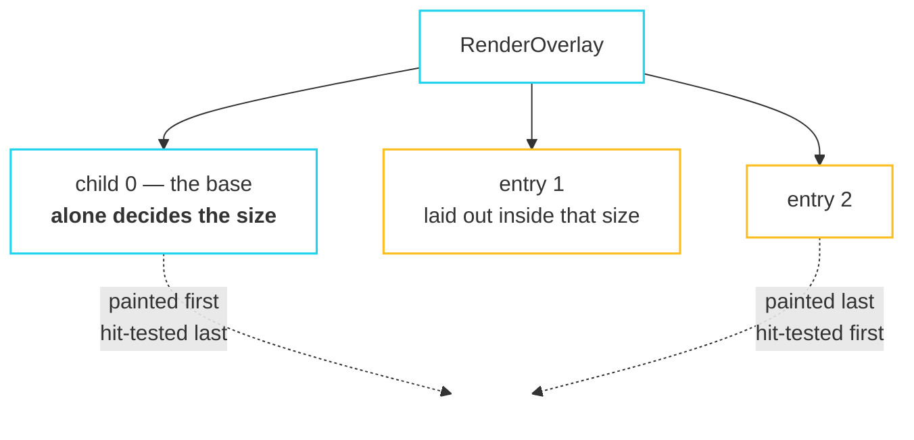

import { Aside, Steps } from '@astrojs/starlight/components';

Tooltips, dropdowns, context menus, drag ghosts and modal dialogs all need to
draw outside their parent's subtree. That is what the overlay is. Dialogs and
menus additionally need to survive their own removal long enough to fade out —
that is a separate, much more expensive mechanism, and it is worth understanding
why.

## The overlay



The base alone decides the layout. However large an entry is, the tree underneath
it is laid out exactly as it would have been without the overlay — inserting a
dropdown cannot reflow the page behind it.

```cpp
// Nothing creates an overlay for you. A tree without one holds no entries,
// no scope, and no extra render object.
Overlay::make({.child = yourApp})

// Later, from a callback — never from a build.
OverlayState* overlay = Overlay::of(context);   // an ambient read, so: during a build
overlay->insert(entry);
```

### An entry is consumer-owned

```cpp
class OverlayEntry final : public Listenable {
  explicit OverlayEntry(Callback<WidgetRef(BuildContext&)> builder);
  ~OverlayEntry();              // removes itself if still inserted
  void markNeedsBuild();        // rebuilds *this entry* and nothing else
  bool inserted() const;  void remove();
};
```

You own it, like a `ScrollController` or a `FocusNode`. Both teardown orders are
safe: destroying an inserted entry removes it, and an overlay going away first
clears the entry's back-pointer.

<Aside type="note" title="An entry is named by id, not by pointer">
The host widget that builds an entry refers to it by an `std::int64_t`, not by
address — precisely because an entry can be destroyed part-way through the build
that would have rebuilt it. `entryById` returns null once it is gone, which is a
lookup rather than a dangling read.
</Aside>

Inserting costs the overlay one build and nothing else. The base is not
rebuilt, not re-laid-out, and not repainted.

## Anchoring

```cpp
AnchorLink link;   // consumer-owned, a Listenable

// Where the anchor is:
Anchor::make({.link = &link, .child = theButton})

// What follows it, inside an overlay entry:
Anchored::make({
  .link = &link,
  .anchorSide = Alignment::bottomLeft(),
  .childSide = Alignment::topLeft(),
  .keepOnScreen = true,
  .child = theMenu,
})
```

**Size is resolved at layout; position is resolved at paint.** Paint is the one
phase where every ancestor offset is final, so that is where the anchor's
rectangle in root space is actually knowable. `keepOnScreen` clamps a menu opened
near an edge.

<Aside type="caution" title="An anchored entry follows a repaint, not a movement">
If something moves the anchor without laying it out — a scroll, which is a paint
operation — the entry does not know. Call `AnchorLink::markMoved()` in that case.
This is a recorded divergence: tying the entry to layout instead would have made
every scroll frame relayout the overlay.
</Aside>

## Exit animations

This is the single most expensive item in fltr per unit of user-visible benefit,
and it is worth knowing exactly what it does.

```cpp
AnimatedSwitcher::make({
  // Null is a child too: it animates whatever is there out and leaves nothing.
  .child = open ? menu() : WidgetRef{},
  .animation = {.duration = 0.18f, .curve = Curves::easeOut},
  .transition = &slidePresence,
})
```

### The mechanism was already there

`AnimatedSwitcher` retains the outgoing **element** — not the widget — by
re-emitting its stale `WidgetRef` on every build. Recall from
[three trees](/fltr/architecture/overview/) that reconciliation reads:

```cpp
if (!widget.stale()) child->update(widget);
```

A stale ref means *unchanged*, so the subtree stays mounted, keeps its `State`,
keeps ticking, and is **never rebuilt** while it leaves.

<Steps>

1. **A subtree on its way out is inert.** `IgnorePointer` and
   `Focus(canRequestFocus = false)` guards are *always* present, with only their
   flag moving — so a leaving panel does not change the tree's shape and does not
   swallow a click aimed at what is behind it.

2. **Interruption re-enters rather than duplicating.** Reopening a menu that is
   half-faded-out revives the same subtree from wherever it reached, instead of
   creating a second copy that crossfades with the first.

3. **Letting go happens in the build.** The element is dropped on the first build
   after its presence reaches zero — not from inside the animation callback,
   which would be tearing down a tree from within a notification it is walking.

</Steps>

<Aside type="danger" title="Keys must be unique per presence">
Two subtrees are alive at once during a transition, and the switcher tells them
apart by key. Two presences with the same key is the exact hazard that makes a
stale ref reach `inflate` — a contract violation with checks on, undefined
behaviour with them off. Key by *what the page is*, not by what widget it
happens to be.
</Aside>

## Writing a transition

```cpp
using PresenceTransition = Callback<WidgetRef(WidgetRef, ValueListenable<float>&)>;

WidgetRef fadePresence(WidgetRef child, ValueListenable<float>& presence);  // the default
```

The presence value is a `ValueListenable<float>` going from 0 to 1, and it is
handed to a render object, so a fade costs one repaint per frame and no builds.

To slide as well as fade you need a `ValueListenable<Transform2D>`, which means
owning a small adapter in a `State`:

```cpp
// A plain function is what the callback slot holds; the state it needs lives in
// the widget it returns.
WidgetRef slidePresence(WidgetRef child, ValueListenable<float>& presence) {
  return PresenceSlide::make({.presence = &presence, .child = child});
}
```

The walkthrough builds `PresenceSlide` in about thirty lines and uses it for
every page transition and for the pause panel.

## What is not here

**Drag and drop.** The overlay is the piece a drag ghost needs, and it exists.
The drop machinery — draggables, drop targets, and the hit testing between them —
was never built.
