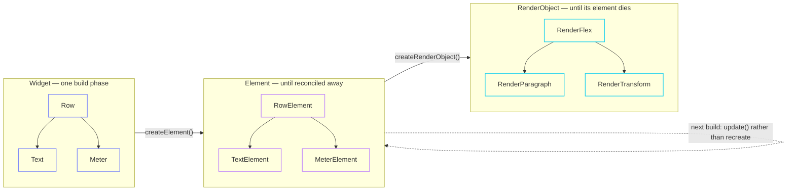

import { Aside, Card, CardGrid } from '@astrojs/starlight/components';

Declarative UI and incremental update pull in opposite directions. Describing a
screen top-to-bottom is pleasant to write and throws away everything you knew
about the previous frame; updating incrementally needs that knowledge. Flutter's
answer, and fltr's, is to stop pretending they are the same object.



## Three lifetimes

| | Lifetime | Ownership | Where |
|---|---|---|---|
| **Widget** | one build phase | `Arena`, released wholesale | `widgets/framework.hpp` |
| **Element** | until reconciled away | `unique_ptr` down, raw pointer up | `widgets/framework.hpp` |
| **RenderObject** | until its element dies | `unique_ptr` down, raw pointer up | `render/object.hpp` |

There is no reference counting anywhere in the tree and no cycles. Ownership
points downward and only downward; every upward reference is non-owning.

### Widgets are arena scratch

A build allocates its widgets from a bump allocator and the whole arena is reset
at the end of the phase — a pointer store and a generation bump. Chunks are
retained, so the steady state allocates **nothing**.

That is only affordable if resetting is free, which means widgets must be
trivially destructible. `Arena::create<T>` enforces it:

```cpp
// Rejected at compile time if T has a non-trivial destructor.
template <class T, class... Args> T* create(Args&&...);

// The explicit escape hatch, which registers a destructor to run at reset.
template <class T, class... Args> T* createOwning(Args&&...);
```

The verbosity of `createOwning` is the point: a widget that owns heap memory
should read as the exception it is.

<Aside type="caution" title="What this costs you">
Anything a widget refers to by pointer — a `ScrollController`, a `FocusNode`, a
`WidgetStatesController`, a `ValueListenable<T>`, the `string_view` inside a
`Text` — must outlive the widget, because the widget will not keep it alive.
This rule recurs everywhere; see [memory and
lifetimes](/fltr/architecture/memory-and-lifetimes/).
</Aside>

## Divergence: elements adopt their configuration by value

Flutter's `Element` holds a pointer to a `Widget` that the garbage collector
keeps alive as long as the element needs it. With an arena that resets every
build, that pointer would dangle before the next frame.

**Chosen:** each `Element<W>` stores a `W` **by value**. `update()` is one
assignment — a `memcpy` for the plain-old-data configurations that are the norm.

```cpp title="widgets/framework.hpp"
void update(WidgetRef widget) final {
  FLTR_EXPECTS(widget.type() == widgetTypeOf<W>(), "...");
  adopt(static_cast<const W&>(*widget));
  this->dirty_ = true;
  this->rebuild();
}
```

**What it costs:** a widget configuration is copied once per update instead of
being pointed at, and configurations therefore want to stay small. In exchange,
the arena reset stays a pointer operation and no element can outlive the memory
its configuration came from.

## `WidgetRef`, and why a stale one means "unchanged"

A build hands back a `WidgetRef` — a fat handle carrying the widget pointer, its
type, its key, and the arena generation it was created in. Type and key are
carried **by value**, so a ref whose arena has since been reset can still be
compared for reconciliation without being dereferenced.

That is not a micro-optimisation; it is load-bearing. `Element::updateChild`
reads:

```cpp
if (!widget.stale()) child->update(widget);
```

Re-emitting a stale ref is how a subtree is *retained without being rebuilt* —
which is exactly what [`AnimatedSwitcher`](/fltr/architecture/overlay/) does to
keep a subtree alive while it animates away.

<Aside type="danger" title="The sharp edge">
A stale ref reaching `inflate` — being used to build something new rather than to
match something existing — is a contract violation. With `FLTR_CHECKS=1` it
traps; with checks off it is undefined behaviour. In practice this only happens
if you cache a `WidgetRef` across frames, so don't.
</Aside>

## Reconciliation

`Element::updateChild(ElementPtr, WidgetRef)` is the single junction where the
old tree meets the new configuration. Two things can match:

- the **runtime type** of the widget, and
- its **`Key`**.

Both must agree, or the old element is discarded and a new one inflated. That is
`Widget::canUpdate`, and it is the whole identity model — there is no immediate
mode ID stack and nothing is hashed per frame.

For lists, `ChildList::update` runs Flutter's algorithm: match a leading
positional run, match a trailing positional run, then reclaim keyed elements out
of the middle. The scratch buffers are members, so reconciling allocates nothing.

<CardGrid>
  <Card title="Keyed children survive reordering" icon="approve-check">
    A keyed element keeps its `State`, its render object, its layout results and
    its animation drivers when it moves. An unkeyed one is matched by position,
    so moving it means the state stays where the *position* was.
  </Card>
  <Card title="String keys must outlive the element" icon="warning">
    `Key::of(const char*)` stores the pointer and a hash of the contents, with a
    `strcmp` fallback on collision. A key pointing into per-frame scratch
    dangles. Literals are the intended case.
  </Card>
</CardGrid>

## Divergence: no slots; order is a permutation pass

Flutter identifies a child's position in its parent render object by a slot
object. fltr instead lets `MultiChildRenderElement` gather the element order
after reconciliation and hand it to `RenderBoxContainer::reorderChildren`, which
swaps slots in place. A moved child keeps its layout state, its paint state and
its parent data.

**What it costs:** one extra pass over the children of a multi-child element
whose order actually changed, and the reorder is `O(n)` in the children rather
than `O(1)` per move.

## Divergence: per-child data lives in the parent

Flutter heap-allocates a `ParentData` object per child and hangs it off the
child. fltr's `RenderBoxContainer<Data>` stores it inline:

```cpp
struct Slot {
  std::unique_ptr<RenderBox> child;
  ChildData data{};
  Offset offset{};
};
```

Statically typed, no allocation, and a child cannot be asked for parent data that
belongs to a different kind of parent. `ParentDataSlot` carries a type tag, so
putting a `Flexible` inside a `Stack` is *refused* rather than reinterpreting
memory.

**What it costs:** a child cannot read its own parent data. Nothing in the
catalogue has needed to.
