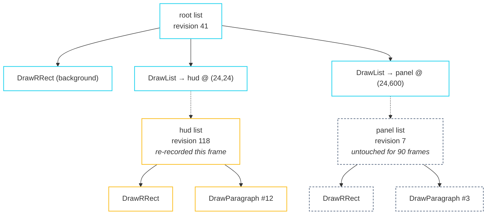

import { Aside, Card, CardGrid } from '@astrojs/starlight/components';

There is no `Canvas`, no `Renderer` abstract base, and nothing to subclass.
Painting produces a **flat, trivially copyable, contiguous array of commands**,
and a consumer walks it. That is the entire contract.

```cpp title="paint/display_list.hpp"
enum class PaintOp : std::uint8_t {
  PushTransform, PushClipRect, PushOpacity, Pop,   // state stack
  DrawRect, DrawRRect, DrawImage, DrawParagraph,
  DrawList,                                        // the repaint-boundary seam
};

struct PaintCmd {
  PaintOp op;
  union { /* one payload struct per op */ };
};

static_assert(std::is_trivially_destructible_v<PaintCmd>);
static_assert(std::is_trivially_copyable_v<PaintCmd>);
```

Those two `static_assert`s are the design. A list is an array you can `memcpy`,
walk without indirection, hand to another thread, or serialise.

## `DrawList` is where the cost savings live

A repaint boundary owns its own `DisplayList`. Its parent does not inline it —
the parent records a **reference** to it, with an offset:



Moving a boundary re-records only the parent's (tiny) list. Repainting a
boundary's *contents* re-records only that boundary's list. Neither touches the
other.

```cpp title="src/render_object.cpp"
void PaintingContext::paintChild(RenderObject& child, Offset offset) {
  if (child.isRepaintBoundary()) {
    DisplayList& sub = child.boundaryList();
    if (child.needsPaint() || sub.revision() == 0) {
      sub.beginRecording();
      PaintingContext inner(sub);
      child.paintWithContext(inner, Offset::zero());   // at its OWN origin
      sub.endRecording();
    }
    list_.drawList(&sub, offset);
  } else {
    child.paintWithContext(*this, offset);
  }
}
```

Note that a boundary paints at its own origin. That is what lets the parent
reposition it with one command instead of re-recording its subtree.

**Boundaries in the tree today:** `RenderView` (the root, always), any
`RepaintBoundary` widget you add, and every `RenderViewport`.

## Caching on `(list, revision)`

`DisplayList::beginRecording` bumps a per-list `revision()`. `Scene::revision`
counts re-recordings across the whole pipeline.

<CardGrid>
  <Card title="Immediate-mode backends" icon="seti:shell">
    raylib, or anything that redraws the framebuffer each frame, walks the list
    every frame regardless. `Scene::revision` is still useful — combined with
    `needsFrame()` it tells you the frame is identical to the last one.
  </Card>
  <Card title="Retained-mode backends" icon="seti:db">
    Translate a list once into whatever your renderer retains — a command buffer,
    a vertex batch, a scene node — and key the cache on the pair
    `(const DisplayList*, revision())`. A boundary whose revision has not moved
    is byte-for-byte the recording you already translated.
  </Card>
</CardGrid>

## The state stack

`PushTransform`, `PushClipRect` and `PushOpacity` open a group; `Pop` closes the
innermost one. They nest but do not alternate, so a backend has to remember which
kind opened in order to know which stack a `Pop` unwinds:

```cpp
enum class Group : unsigned char { Transform, Clip, Opacity };
std::vector<Group> groups_;
```

`endRecording` asserts the recording is balanced, so a malformed list never
reaches you.

<Aside type="caution" title="Two places the command promises more than a simple backend can deliver">
**`PushClipRect` carries a `BorderRadius`.** A scissor rectangle cannot express
rounded corners. Honouring it properly needs a stencil pass or a shader; the
walkthrough backend drops the corners and says so.

**`PushOpacity` has no analogue in an immediate-mode renderer.** There is no
global alpha to set. The backend has to multiply the alpha into every colour it
emits inside the group, which is correct for non-overlapping content and subtly
wrong for content that overlaps itself. A backend that wants it exact renders the
group to a texture and composites once.
</Aside>

## Resources are yours

```cpp
using ImageHandle     = std::uint64_t;
using ParagraphHandle = std::uint64_t;
using FontHandle      = std::uint64_t;
```

The framework never loads, allocates, frees, or inspects any of these. It puts
the number in a command and hands it back. What the number means is entirely
between you and your own registry.

`Color` is straight (non-premultiplied) RGBA8. The framework never blends.

## `Transform2D` is 2D affine, on purpose

Six floats, 24 bytes, `{a, b, c, d, tx, ty}`:

```cpp
constexpr Offset apply(Offset p) const noexcept {
  return {a * p.dx + c * p.dy + tx, b * p.dx + d * p.dy + ty};
}
```

**Why not 4×4:** hit testing has to invert the transform *exactly* to map a
global point into a local one. A 4×4 with perspective inverts only partially, and
a partially-correct hit test is worse than a restricted transform. Rotation,
scale, skew and translation are all expressible; perspective is not.

## What a backend actually looks like

```cpp
void submit(const DisplayList& list) {
  for (const PaintCmd& cmd : list.commands()) {
    switch (cmd.op) {
      case PaintOp::PushClipRect:  pushClip(cmd.pushClipRect.rect); break;
      case PaintOp::PushOpacity:   alpha_.push_back(alpha_.back() * cmd.pushOpacity.alpha); break;
      case PaintOp::Pop:           popInnermost(); break;
      case PaintOp::DrawRRect:     drawRoundedRect(cmd.drawRRect); break;
      case PaintOp::DrawParagraph: text_.draw(cmd.drawParagraph.paragraph, ...); break;
      case PaintOp::DrawList:      submitAt(*cmd.drawList.list, cmd.drawList.offset); break;
      // ...
    }
  }
}
```

The [writing a backend](/fltr/guides/writing-a-backend/) guide covers every
command, and the walkthrough builds a complete raylib one in about 180 lines.

## No compositing layer tree

There is not one, and adding one would be additive rather than a rewrite:
`DrawListCmd` is exactly where a compositor would slot in — give it a transform
and opacity slot and let a compositor own those lists. That is deferred until a
real backend demonstrates it is needed.
