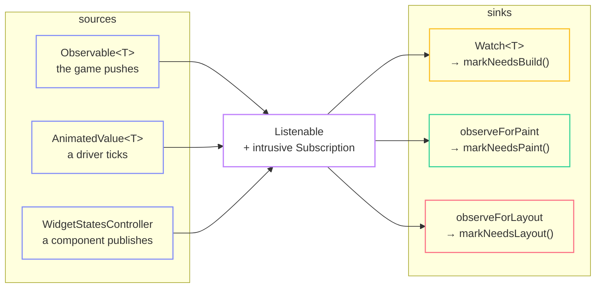

import { Aside, Card, CardGrid } from '@astrojs/starlight/components';

fltr does not rebuild the tree every frame. Game state changes at arbitrary times
and is pushed in from your loop; the framework decides what that implies for
work. The mechanism is one small observable core with three different consumers.



The same signal reaches all three, and which sink you pick is a call-site
decision. It is the biggest performance lever in the framework.

## The core

```cpp title="core/listenable.hpp"
class Subscription {           // intrusive, allocation-free, move-only
  void detach() noexcept;
  bool attached() const noexcept;
  Listenable* source() const noexcept;
};

class Listenable {
  void subscribe(Subscription&, Subscription::Fn, void* ctx);
protected:
  void notifyListeners();
};

class Notifier final : public Listenable { /* exposes notifyListeners publicly */ };

template <class T, void (T::*M)()> void subscribeMember(Listenable&, Subscription&, T*);
```

A `Subscription` is a doubly-linked node owned by the observer. Subscribing costs
two pointer stores, and it unhooks itself in its destructor. A render object can
therefore hold an animation subscription with no shared ownership and no
reference counting anywhere in the tree.

`notifyListeners` is safe against a listener that subscribes, detaches itself, or
detaches the not-yet-visited successor, via a cursor chain that
`Subscription::detach()` steps past.

## Observables

```cpp title="core/observable.hpp"
template <class T> class ValueListenable : public Listenable {
  virtual const T& value() const noexcept = 0;
};

template <class T> requires std::equality_comparable<T>
class Observable final : public ValueListenable<T> {
  void set(T next);   // an equal value is a no-op and notifies nobody
};

template <class T> requires std::equality_comparable<T>
class Animatable {    // a render property: a constant, or a source that shadows it
  bool set(T next);                          // returns "needs invalidating"
  bool setSource(ValueListenable<T>* next);
};
```

The no-op on an equal value is why your loop can push its whole state every frame
without thinking about it:

```cpp
void Session::publish() {
  hullFraction.set(ship_.hull() / Ship::kHullMax);
  remaining.set(static_cast<int>(field_.asteroids().size()));
  speed.set(static_cast<int>(std::lround(ship_.speed())));   // rounded on purpose
}
```

<Aside type="tip" title="Quantise before you push">
The ship's speed changes every frame; the displayed speed does not. Rounding to a
whole number before pushing turns 60 rebuilds a second into one rebuild whenever
the digits change. fltr cannot make that decision for you, since it does not know
how you will render the number.
</Aside>

## `Watch<T>`: the rebuild sink

```cpp
Watch<int>::make({
  .value = &session.score,
  .builder = [](BuildContext& context, const int& score) -> WidgetRef {
    return Text::make({.text = format(score), .style = ...});
  },
})
```

It is a `StatefulWidget` rather than a new element kind, so nothing in the
framework has to know it exists. It cannot tell an `Observable<T>` from an
`AnimatedValue<T>`: the value moved, so the subtree that reads it rebuilds.

Use it when the structure of the subtree changes with the value. When only the
painting changes, use the next one.

## `observeForPaint`: the cheap sink

```cpp title="render/object.hpp"
void observeForPaint(Subscription& slot, Listenable* source);   // → markNeedsPaint
void observeForLayout(Subscription& slot, Listenable* source);  // → markNeedsLayout
```

A render object observes the value directly. A tick invalidates one render object,
rebuilds nothing and lays out nothing. At the widget layer this is an `animation`
field:

```cpp
Opacity::make({.animation = &fade, .child = panel()})
Transform::make({.animation = &slide, .child = page()})
DecoratedBox::make({.animation = &surface, .child = label()})
```

`Align::animation` uses `observeForLayout` instead, and its doc comment says so.
Alignment is resolved during layout, so driving it from an animation lays out the
subtree every frame. Correct, and the expensive one.

<CardGrid>
  <Card title="Rule of thumb" icon="approve-check">
    If the thing that changes is a colour, an alpha, a transform, or a scroll
    offset, there is a paint-only path for it. Reach for the rebuild only when
    the widget tree itself has to be different.
  </Card>
  <Card title="Deriving new animated properties" icon="puzzle">
    A component publishes a `float`; `Transform` wants a `Transform2D`. Write a
    small `ValueListenable` that subscribes to one and republishes the other, own
    it in a `State`, and you keep the zero-rebuild property. The walkthrough does
    this three times.
  </Card>
</CardGrid>

## Ambient values

```cpp
Ambient<Theme>::make({.value = theme, .child = subtree})
const Theme& theme = Ambient<Theme>::of(context);
```

`T` must be trivially destructible and equality-comparable. Changing it rebuilds
exactly the elements whose last build read it. A widget sitting between the value
and its readers is not disturbed, so a theme change does not walk the tree it
applies to.

### Divergence: the scope is a snapshot, not a map

`InheritedScope` is an open-addressed hash table, power-of-two, never more than
half full, keyed by widget type. An element that introduces a value copies its
parent's entries and adds one; every other element points at its parent's scope.

A scope holds no link to the one it extended, so a lookup cannot degrade into an
ancestor walk. It is one probe at any depth.

**What it costs:** introducing an ambient value copies a small table. Reading one
is O(1) forever after.

### Dependencies are subscriptions

`Element::dependOnInherited` both reads and subscribes. `Element::dependencies_`
is cleared at the top of every `rebuild()`, so a build that stops reading a value
stops being woken by it and no stale dependency leaks.

`InheritedElement::adopt` notifies its readers before reconciling its subtree, so
a deep reader is rebuilt in the same frame even when everything between it and
the value was skipped.

## No notification bus

There is no `Notification` bubbling up the element tree, and no
`ScrollNotification` equivalent. Every consumer of a scroll signal is inside or
below the `Scrollable` and can read the position from the ambient scope, which is
already O(1) with correct subscription lifetimes.

**What it costs:** an ancestor cannot passively observe a descendant scrolling.
`Scrollbar` and `Overscroll` therefore wrap the scrollable and are handed a
controller rather than listening from above. `NestedScrollView`-style
coordination is off the table until someone wants it.
