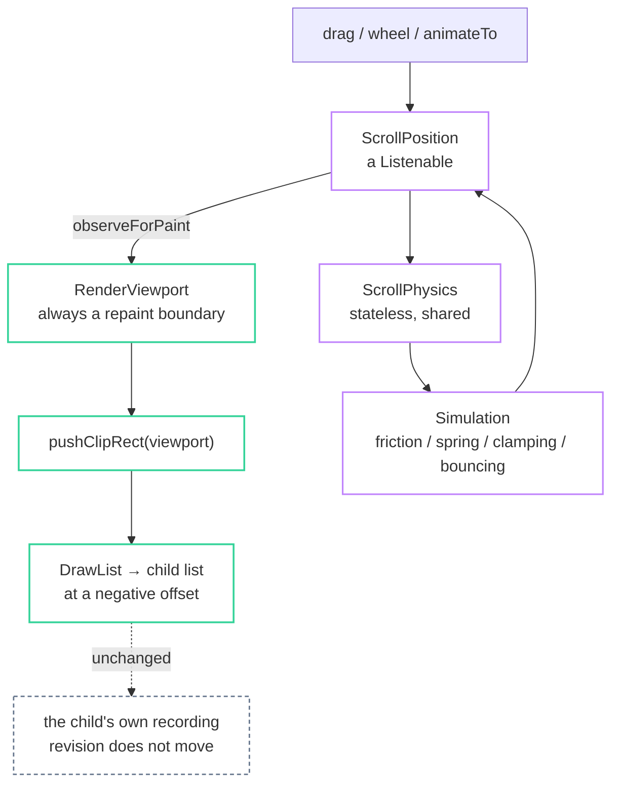

import { Aside, Card, CardGrid } from '@astrojs/starlight/components';

Scrolling in fltr is a paint operation, and the test suite measures that rather
than assuming it.



`RenderViewport` lays its child out once, with the scroll axis unbounded, then
paints it at a negative offset inside a clip:

```cpp title="src/scroll_viewport.cpp"
void RenderViewport::paint(PaintingContext& context, Offset offset) {
  const Offset scrolled = offset + paintOffset();
  context.pushClipRect(Rect::fromOriginSize(offset, size_), BorderRadius::zero(),
                       [&](PaintingContext& c) { c.paintChild(*child_, scrolled); });
}
```

It `observeForPaint`s the position and is a repaint boundary, so a frame of
scrolling re-records one clip and one `DrawList` reference rather than the
content. Hit testing applies the same `paintOffset()`, so what you click is what
you see.

## `ScrollPosition`

The one object that holds where you are, and the only stateful thing in the
subsystem.

```cpp title="scroll/position.hpp"
float pixels() const;   float maxScrollExtent() const;   float overscroll() const;
void applyViewportDimension(float);  void applyContentDimensions(float min, float max);

void jumpTo(float);
void animateTo(float value, float duration, Curve curve = Curves::easeInOut);
void ensureVisible(const RenderObject& target, float alignment = 0.0f, float duration = 0.0f);
void revealMinimally(const RenderObject& target, float duration = 0.0f);

void beginDrag();  void applyDragDelta(float);  void endDrag(float velocity);
bool applyWheelDelta(float);  bool applyPanDelta(float);
void goBallistic(float velocity);  void goIdle();
```

`revealMinimally` is what focus traversal wants: creep by one row rather than
jumping the item to the top. `ensureVisible` is what a "scroll to here" button
wants.

### Divergence: activities are an enum, not a hierarchy

Flutter has a `ScrollActivity` class hierarchy. fltr has:

```cpp
enum class ScrollActivityKind : std::uint8_t { Idle, Drag, Ballistic, Wheel, Driven };
```

A drag or a wheel notch therefore starts without allocating anything.

**What it costs:** a sixth mode means editing a switch statement, and consumers
cannot add their own activity kind.

## Physics is a stateless policy object

```cpp title="scroll/physics.hpp"
class ScrollPhysics {
  virtual float applyPhysicsToUserOffset(const ScrollMetrics&, float offset) const;
  virtual float applyBoundaryConditions(const ScrollMetrics&, float value) const;
  virtual std::unique_ptr<Simulation> createBallisticSimulation(const ScrollMetrics&,
                                                                float velocity) const = 0;
  virtual bool allowsUserScrolling(const ScrollMetrics&) const;
};
```

Shipped as shared constants: `ClampingScrollPhysics` (Android),
`BouncingScrollPhysics` (iOS), and `NeverScrollPhysics` (disabled without losing
the position). Nothing allocates a physics object per scrollable; you point at
one.

Overscroll is what the boundary refused. `applyBoundaryConditions` returns the
part of a delta it would not accept, and the stretch is rendered through the
existing render-attached transform path.

## The widgets

| Widget | What it is |
|---|---|
| `Scrollable` | Owns a `ScrollPosition`, handles drag, wheel and fling. Takes a consumer-owned `ScrollController` and a shared `ScrollPhysics*`. |
| `Viewport` | The render object underneath, if you want it without the gestures. |
| `ScrollScope` | The ambient value publishing the position downward. `ScrollScope::of(context)` is null outside a scrollable. |
| `Scrollbar` | Wraps a scrollable. Fades on idle, widens on hover, draggable thumb. |
| `Overscroll` | Wraps a scrollable. Stretches the content at the ends, anchored at the edge that refused. |
| `ScrollbarThumb` | The bare thumb, if you want to place it yourself. |

```cpp
Scrollbar::make({
  .controller = &controller,
  .child = Overscroll::make({
    .controller = &controller,
    .child = Scrollable::make({.controller = &controller, .child = column}),
  }),
})
```

<Aside type="note" title="Why they wrap rather than listen">
Because there is no notification bus. An indicator drawn outside a scrollable
cannot passively observe it, so it is handed the same controller instead. The
controller is watched as well as the position: an indicator wrapping a scrollable
is built first, before the scrollable below it has a position at all.
</Aside>

<Aside type="caution" title="One controller drives at most one position">
Flutter allows a controller to drive several. Here it is one, and the two clear
each other's pointer on destruction so either outliving the other is inert.
</Aside>

## The limitation

<CardGrid>
  <Card title="Non-lazy, single child" icon="warning">
    A `Scrollable` lays out one child with the scroll axis unbounded. Every
    descendant is built and laid out whether or not it is visible.

    A few hundred children are fine and cost nothing per frame in steady state. A
    few thousand are not.
  </Card>
  <Card title="What that rules out" icon="information">
    No `ListView.builder`, no slivers, no pinned or floating headers, no
    recycling. A chat log, a full leaderboard, or an item database with thousands
    of rows needs the lazy layer that has not been built.
  </Card>
</CardGrid>

The reasoning behind the choice: position, physics, activities, controller,
wheel, overscroll and the scrollbar are all identical whether or not children are
lazy. Adding laziness later needs build-during-layout, which means a scoped
exemption from phase separation plus keeping the build arena open across layout,
but it does not need any of the above revisited.
