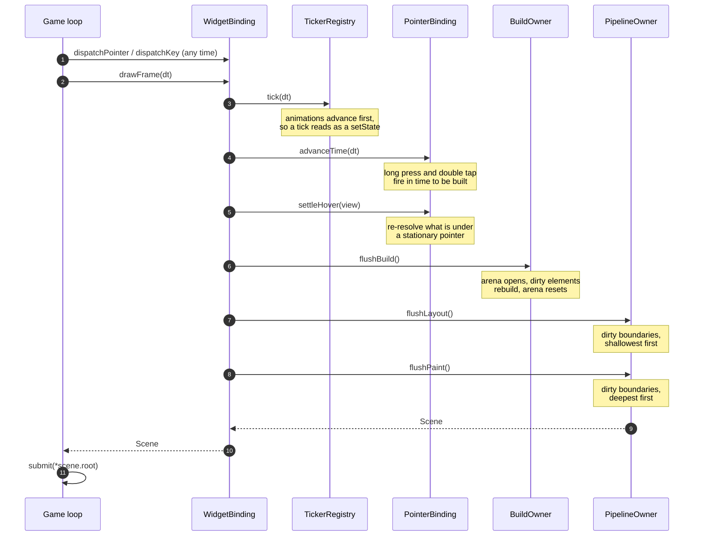

import { Aside, Steps } from '@astrojs/starlight/components';

`WidgetBinding::drawFrame(float seconds)` is the only call into fltr's frame.
Everything else — dispatching input, pushing state — happens outside it, at
whatever rate your platform produces events.



## The five orderings that matter

<Steps>

1. **Animations tick before the build.** A tick becomes a `setState` on whatever
   is watching it. Ticking *after* `flushBuild` would leave every `Watch` showing
   last frame's value — one frame of lag on every animated readout in the tree.

2. **The gesture clock advances before the build too.** A long press whose timer
   expires during this frame fires its callback now, so the menu it opens is
   built in this frame rather than the next one.

3. **Hover settles before the build, against last frame's layout.** Moving the
   pointer is not the only way the thing under it changes — the tree can move
   beneath a stationary pointer. Re-resolving here means whatever enter/exit
   produces is built in the same frame.

4. **Layout flushes shallowest-first.** A parent's layout subsumes any dirty
   descendant, so sorting by depth means each dirty node is visited once.

5. **Paint flushes deepest-first.** A repaint boundary that repaints on its own
   is already clean by the time an ancestor embeds it by reference, so the
   ancestor's `DrawList` command points at a current recording.

</Steps>

## The code

```cpp title="src/widget_binding.cpp"
Scene WidgetBinding::drawFrame(float seconds) {
  if (seconds > 0.0f) {
    tickers_.tick(seconds);
    pointers_.advanceTime(seconds);
  }
  if (view_) pointers_.settleHover(*view_);

  buildOwner_.resetBuildCount();
  buildOwner_.flushBuild();

  Scene scene = pipeline_.drawFrame();   // flushLayout, flushPaint, scene

  // Layout is what moves boxes; a paint-only change cannot alter what is under
  // the cursor, so hover is only invalidated when something actually laid out.
  if (pipeline_.stats().layouts > 0) pointers_.mouseTracker().invalidate();
  return scene;
}
```

## Skipping a frame entirely

```cpp
bool WidgetBinding::needsFrame() const noexcept {
  return buildOwner_.needsBuild() || pipeline_.needsFrame() ||
         pointers_.mouseTracker().needsResolve() || tickers_.hasActiveTickers() ||
         pointers_.hasPendingTimeouts();
}
```

You rarely need it. `drawFrame` with nothing dirty performs no work in any phase
and returns a `Scene` whose `revision` is unchanged, so the cheaper test is
usually "did `revision` move" on the output rather than "will it move" on the
input. `needsFrame` earns its place when the *submission* is expensive — a
retained-mode backend that would otherwise re-walk the list.

## Non-convergence is capped, not asserted away

A node cannot spin on its own: it is still marked dirty while its own
`performLayout` runs, so marking itself short-circuits. Two nodes dirtying *each
other* can spin, and that is a real bug class in this design.

The drain is capped at 32 passes in every build. The failure mode is therefore
one stale frame rather than a frozen game, and `FrameStats::layoutPasses` exposes
the count — a healthy frame is 0 or 1.

<Aside type="caution" title="It degrades silently in release">
With `FLTR_CHECKS=0` a pathological tree simply produces a stale frame with no
diagnostic. Assert on `layoutPasses <= 1` in your own smoke test; the walkthrough
demo does exactly that.
</Aside>

## Phase separation is enforced

`PipelineOwner` tracks which phase it is in, and the invariants are checked in
both directions:

- `markNeedsLayout` refuses to run during the paint phase — painting must not
  dirty layout.
- `paintWithContext` requires the paint phase — nothing may be painted outside it.

A detached tree has no owner and therefore no phase, which is how tests construct
render objects by hand and lay them out directly.

Phase restoration is exception-safe: a `PhaseScope` restores `Idle` even when a
contract violation throws, so one reported failure does not become a confusing
second one during teardown.

## What comes out

```cpp
struct Scene {
  const DisplayList* root = nullptr;
  Size surface;
  std::uint64_t revision = 0;
};
```

`revision` counts how many display lists the pipeline has re-recorded in total,
across the whole tree. Unchanged since last frame means nothing anywhere was
re-recorded, and you may resubmit whatever you submitted last time.

## Frame statistics

`PipelineOwner::stats()` is reset at the start of every frame:

| Field | What a healthy frame looks like |
|---|---|
| `layouts` | 0 when nothing structural changed |
| `paints` | 0 when nothing visual changed |
| `boundariesRelaidOut` | small, and bounded by the dirty set |
| `boundariesRepainted` | 1 for a HUD number ticking inside a repaint boundary |
| `layoutPasses` | 0 or 1. Anything more means layout dirtied an unvisited ancestor. |

Alongside them, `BuildOwner::buildCount()` and
`TickerRegistry::activeTickerCount()` are the two numbers that turn "hovering
costs no rebuilds" and "a hidden animation costs nothing" from claims into
assertions.
