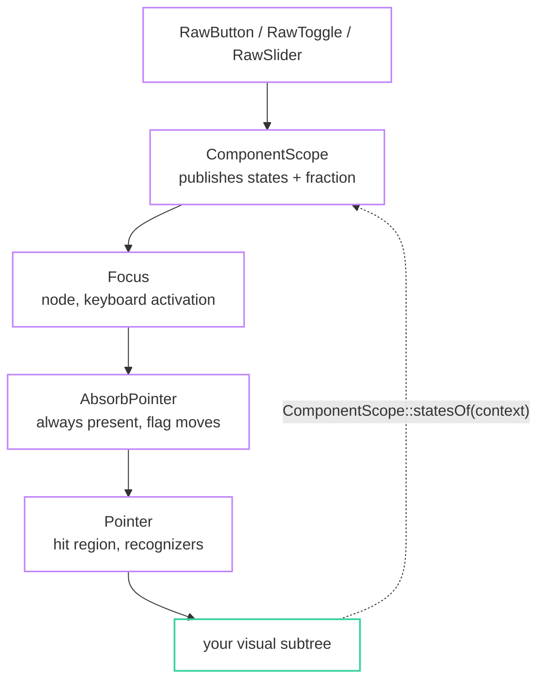

import { Aside, Card, CardGrid, Tabs, TabItem } from '@astrojs/starlight/components';

fltr has a component layer that Flutter keeps private. `RawButton`, `RawToggle`,
`RawSlider` and `RawProgress` own their value, their hit regions, their gesture
recognizers, their focus node and their keyboard handling. They own nothing about
how any of it looks.

You supply the visual subtree. What flows between the two is a bitset.

```cpp title="components/states.hpp"
enum class WidgetState : std::uint8_t {
  Hovered = 1 << 0, Pressed  = 1 << 1, Focused = 1 << 2,
  Disabled = 1 << 3, Selected = 1 << 4, Dragged = 1 << 5,
};
using WidgetStates = Flags<WidgetState>;

class WidgetStatesController final : public ValueListenable<WidgetStates> { ... };
```

## Every component is the same envelope



The guard is **always present**, with only its flag moving. Disabling a control
therefore does not change the tree's shape and does not re-inflate your visuals.

## Two ways to read it

<Tabs>
  <TabItem label="StatesBuilder: rebuilds">

```cpp
StatesBuilder::make({
  .builder = [](BuildContext&, WidgetStates states) -> WidgetRef {
    return DecoratedBox::make({
      .decoration = states.has(WidgetState::Hovered) ? hovered : rest,
      .child = label(),
    });
  },
})
```

Simple, matches Flutter's `builder` idiom, and costs a rebuild per hover. Use it
when the structure of the visual changes with the state: a checkmark that appears,
a spinner that replaces a label.

Outside a component it builds once with no states set and subscribes to nothing.

  </TabItem>
  <TabItem label="Observable: zero rebuilds">

```cpp
class StyledSurfaceState final : public State<StyledSurface> {
  void onStatesChanged() { retarget(); }   // no setState anywhere

  void retarget() {
    const WidgetStates states = controller_ ? controller_->value() : WidgetStates{};
    const BoxDecoration target = resolveSurface(widget().style(), states);
    if (!(target == decoration_.value())) decoration_.retarget(target);
  }

  WidgetRef build(BuildContext& context) override {
    WidgetStatesController* controller = ComponentScope::statesOf(context);
    if (controller != controller_) { /* re-subscribe, retarget */ }
    return DecoratedBox::make({.animation = &decoration_, .child = widget().child()});
  }

  AnimationDriver driver_;
  AnimatedValue<BoxDecoration> decoration_{driver_, {}};
  Subscription states_;
  WidgetStatesController* controller_ = nullptr;
};
```

The state change retargets an interpolation a render object is already observing.
Hovering rebuilds nothing at all; it repaints one node.

This is the path milestones 7 and 8 paid for, and what the walkthrough uses for
every control.

  </TabItem>
</Tabs>

<Aside type="tip" title="Reading statesOf subscribes to the scope, not the controller">
`ComponentScope::statesOf(context)` makes your element depend on the scope, which
only changes when a different component wraps you. The subscription to the
controller itself is one you make explicitly, which is what lets you route it to a
render object instead of to a rebuild.
</Aside>

## Resolution order

The mapping from a bitset to pixels is yours, and it is worth writing once:

```cpp
BoxDecoration resolveSurface(const SurfaceStyle& style, WidgetStates states) noexcept {
  BoxDecoration decoration = style.rest;
  if (states.has(WidgetState::Selected)) decoration = style.selected;
  if (states.has(WidgetState::Hovered))  decoration = style.hovered;
  if (states.has(WidgetState::Pressed))  decoration = style.pressed;
  if (states.has(WidgetState::Disabled)) decoration = style.disabled;

  // Focus is not a fifth surface: it recolours the border of whichever won, so a
  // focused *and* hovered control still looks hovered.
  if (states.has(WidgetState::Focused) && !states.has(WidgetState::Disabled)) {
    decoration.borderColor = style.focusRing;
    decoration.borderWidth = std::max(decoration.borderWidth, 1.0f);
  }
  return decoration;
}
```

Most specific last. Focus composes rather than replaces.

## The fraction

Components that have a position publish it alongside the states:

```cpp
ValueListenable<float>* fraction = ComponentScope::fractionOf(context);
```

A toggle's on-ness, a slider's value as a fraction of its range, a progress bar's
fill. It is null for a button, which has no such quantity.

To use it without a rebuild you need it as the type the render property wants:
`Transform2D` for a `Transform`, `float` for an `Opacity`. A small adapter owned
by a `State` bridges the two:

```cpp
template <class Out>
class MappedValue final : public ValueListenable<Out> {
public:
  using Fn = Out (*)(float fraction, float parameter);
  void bind(ValueListenable<float>* source, Fn fn, float parameter);
  const Out& value() const noexcept override { return value_; }
  // subscribes to `source`, recomputes, notifies on change
};
```

<CardGrid>
  <Card title="A switch thumb" icon="right-arrow">
    `fraction → Transform2D::translation({t * travel, 0})`, handed to a
    `Transform`. Dragging the thumb repaints one node.
  </Card>
  <Card title="A progress fill" icon="bars">
    `fraction → Transform2D::scaling(t, 1)` with `origin = centerLeft`, handed to
    a `Transform` around a full-width bar. Scaling about the left edge is what
    makes it a fill rather than a zoom, and it is a paint operation, so no layout
    runs.
  </Card>
</CardGrid>

## Text is the exception

There is no animated text colour and no ambient default text style, so a `Text`
takes a fixed `TextStyle` at every call site. That means a label cannot follow
hover without a rebuild.

In practice it does not need to. `enabled` and `selected` are configuration rather
than interaction, so they are known at build time:

```cpp
TextStyle labelFor(const Theme& theme, const MenuButtonSpec& spec) {
  TextStyle style = bodyStyle(theme);
  if (!spec.enabled)     style.color = theme.textFaint;
  else if (spec.selected) style.color = theme.accent;
  return style;
}
```

Let the surface carry hover and press; let the label carry enabled and selected.
Nothing rebuilds on either.

## Themes

There is no theme system. `Ambient<T>` is the mechanism and the tokens are yours:

```cpp
struct Theme {
  Color background, surface, border, text, accent, danger;
  float radius = 6.0f, unit = 8.0f, fontSize = 14.0f;
  friend constexpr bool operator==(const Theme&, const Theme&) noexcept = default;
};
using ThemeScope = Ambient<Theme>;

ThemeScope::make({.value = Theme{}, .child = app})
const Theme& theme = ThemeScope::of(context);
```

`T` must be trivially destructible and equality-comparable. One struct rather
than a dozen ambient values means a theme change notifies once, and O(1) lookup
means reading it anywhere costs a single hash probe.

<Aside type="caution" title="What BoxDecoration can express">
Fill, corner radius, border colour, border width, and nothing else. No gradients,
no shadows, no background images, no blur. A modern look therefore has to be built
out of restraint: hairline borders, small radii, and contrast carried by the
border rather than by a fill. That constraint is on the
[gaps list](/fltr/project/gaps-and-rework/) and it is the most visible one.
</Aside>
