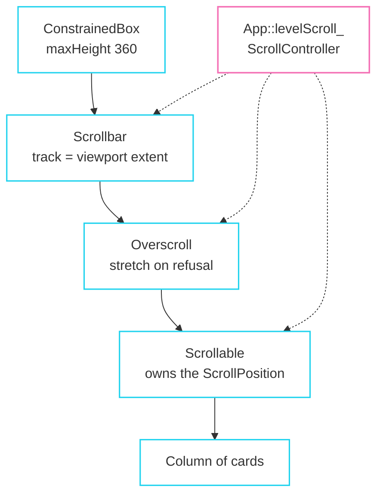

import { Aside, LinkCard } from '@astrojs/starlight/components';

Five asteroid fields, later ones locked. This is the step that exercises scrolling,
`WidgetList::generate`, keyed reconciliation, and the `enabled = false` path.

## The data

```cpp title="docs/demo/src/game/levels.hh"
/// One asteroid field. `unlockScore` is what the previous run has to have banked
/// before this becomes selectable, which is what gives the level list a disabled
/// state to publish.
struct LevelDef {
  const char* name;
  const char* blurb;
  int rocks;
  float driftSpeed;
  int unlockScore;
};

std::span<const LevelDef> levels() noexcept;

class Progress {
public:
  bool unlocked(std::size_t index) const noexcept;
  void recordScore(int score) noexcept;
  int best() const noexcept { return best_; }

private:
  int best_ = 0;
};
```

<Aside type="note" title="Why the strings are const char*, not std::string">
`Text` holds a `string_view` and does not copy. A table of `const char*` in static
storage outlives everything by construction. A `std::vector<std::string>` would
work too, right up until the vector reallocates.
</Aside>

## The list

```cpp title="docs/demo/src/ui/screens/level_select.cc"
/// Level ids are stable strings rather than indices so a keyed element survives
/// the list changing shape -- which it does the moment a level unlocks.
constexpr const char* kLevelKeys[] = {"level.0", "level.1", "level.2", "level.3", "level.4"};

WidgetRef levelSelectScreen(App& app, const Theme& theme) {
  const std::span<const LevelDef> table = levels();
  const Progress& progress = app.session().progress();

  WidgetList items = WidgetList::generate(table.size(), [&](std::size_t i) -> WidgetRef {
    const LevelDef& def = table[i];
    const bool unlocked = progress.unlocked(i);
    return listCard(theme,
                    {
                        .key = Key::of(kLevelKeys[i]),
                        .label = def.name,
                        .trailing = unlocked ? "READY" : "LOCKED",
                        .onPressed = [&app, i] { app.startLevel(i); },
                        // A disabled component still swallows the pointer, so a
                        // locked level never leaks its click to what is behind.
                        .enabled = unlocked,
                        .selected = i == app.session().level(),
                        .autofocus = i == 0,
                    },
                    unlocked ? def.blurb : "Score more to unlock.");
  });
  ...
}
```

`WidgetList::generate` is the braced-list equivalent for a count the call site
cannot spell. Each result is copied into the build arena, exactly as a braced list
is.

### Three states, all published rather than drawn

| Property | Effect |
|---|---|
| `.enabled = unlocked` | publishes `Disabled`, refuses gestures and focus, **still swallows the click** |
| `.selected = i == level` | publishes `Selected`; `listItemStyle` gives it the accent surface |
| `.autofocus = i == 0` | first card takes focus when the screen appears |

`StyledSurface` turns all three into pixels without either side knowing about the
other.

<Aside type="tip" title="Disabled swallows, it does not ignore">
That is what you want here: a locked card is drawn over the scroll content, and a
click on it must not fall through to whatever is behind. For the other behaviour,
wrap it in `IgnorePointer`. Both exist, and this is the distinction between them.
</Aside>

### Keys, again

Keys are stable strings, not indices. A card that unlocks changes its
configuration but keeps its key, so its element, its `State`, its
`StyledSurfaceState` and its in-flight animations all survive.

Reconciling by position would work too, right up until the list changes length.

## The scroll stack

```cpp title="docs/demo/src/ui/screens/level_select.cc"
                  // A scrollable is non-lazy: every card is built and laid out
                  // whether or not it is on screen. Five is fine; five thousand
                  // would not be, and that limit is documented rather than hidden.
                  ConstrainedBox::make({
                      .constraints = {.maxHeight = 360.0f},
                      .child = Scrollbar::make({
                          .controller = &app.levelScroll(),
                          .child = Overscroll::make({
                              .controller = &app.levelScroll(),
                              .child = Scrollable::make({
                                  .controller = &app.levelScroll(),
                                  .child = Padding::make({
                                      .padding = EdgeInsets::only(0.0f, 0.0f, theme.unit, 0.0f),
                                      .child = Column::make({
                                          .crossAxisAlignment = CrossAxisAlignment::Stretch,
                                          .mainAxisSize = MainAxisSize::Min,
                                          .spacing = theme.unit,
                                          .children = items,
                                      }),
                                  }),
                              }),
                          }),
                      }),
                  }),
```

Three widgets, one controller, in a specific order.



### Why the wrapping order

`Scrollbar` and `Overscroll` **wrap** the scrollable rather than living inside it.
Wrapping is what makes the scrollbar's track exactly the viewport's own extent,
which is the assumption its thumb geometry is built on.

### One consumer-owned controller

```cpp title="docs/demo/src/app/app.hh"
fltr::ScrollController levelScroll_;
```

Not owned by any widget. `ScrollController` holds no offset of its own; the
`Scrollable` owns the position and lends it to the controller. The two clear each
other's pointer on the way out, so either outliving the other is inert rather than
dangling.

<Aside type="note" title="The controller is why the outer two work at all">
An ancestor cannot passively observe a descendant scrolling; `ScrollScope` only
publishes downward. So anything drawn *outside* a scrollable is handed a
controller. That is the recorded cost of "no new dispatch mechanisms", and here it
is exactly three identical `.controller =` lines.
</Aside>

`Scrollbar` and `Overscroll` watch the controller as well as the position, because
a controller has no position until the scrollable below it has built, and an
indicator that wraps a scrollable is always built first.

## Not lazy, and it says so

Every card is built and laid out whether or not it is visible. Five is fine; a few
thousand would not be.

That is the same choice Flutter made for `SingleChildScrollView`, and nothing
about the position, the physics, the wheel or the scrollbar would change if lazy
children arrived later. On the [gaps list](/fltr/project/gaps-and-rework/).

## What scrolling actually costs

The child is laid out **once**, unbounded along the axis, and painted at a negative
offset inside a clip. `RenderViewport` observes the position for *paint*, so a
frame of scrolling:

- runs **no layout**;
- re-records the viewport's own display list, a clip and one `DrawList` reference;
- repaints the scrollbar thumb, which also observes for paint.

`stats.layouts` stays at zero through an entire fling. The demo's debug readout
shows it.

## Wheel handling

```cpp title="docs/demo/src/platform/input.cc"
void Input::pumpSignals(fltr::WidgetBinding& binding) {
  const float wheel = GetMouseWheelMove();
  if (wheel == 0.0f) return;

  const Vector2 mouse = GetMousePosition();
  // The notch size belongs to the platform, so the conversion to logical pixels
  // happens here rather than inside the framework.
  binding.dispatchSignal(PointerSignalEvent{.kind = PointerSignalKind::Scroll,
                                            .pointer = 1,
                                            .position = {mouse.x, mouse.y},
                                            .localPosition = {mouse.x, mouse.y},
                                            .delta = {0.0f, -wheel * 48.0f},
                                            .modifiers = currentModifiers()});
}
```

`dispatchSignal` returns whether the UI consumed it. The demo ignores the answer
because it has nothing else to scroll, but a game with a zoomable camera would use
it.

A signal never enters the gesture arena: the innermost scrollable that can still
move takes it, and the rest see it only if that one declines. That is what a
browser does when a scrolled-to-the-end list lets the page scroll instead.

A wheel notch is **eased toward** rather than applied, so spinning the wheel
accumulates into one target instead of jumping once per notch.

<Aside type="note" title="Complete for a menu">
Physics, a fling, a fading draggable scrollbar, an overscroll stretch, and focus
traversal that scrolls the next card into view by the minimum amount.

Two known limits: no lazy children, and no grid. A 5×2 layout of levels would be a
`Column` of `Row`s with the arithmetic done by hand.
</Aside>

<LinkCard
  title="Next: settings"
  description="RawToggle and RawSlider driving real window state."
  href="/fltr/walkthrough/settings/"
/>
