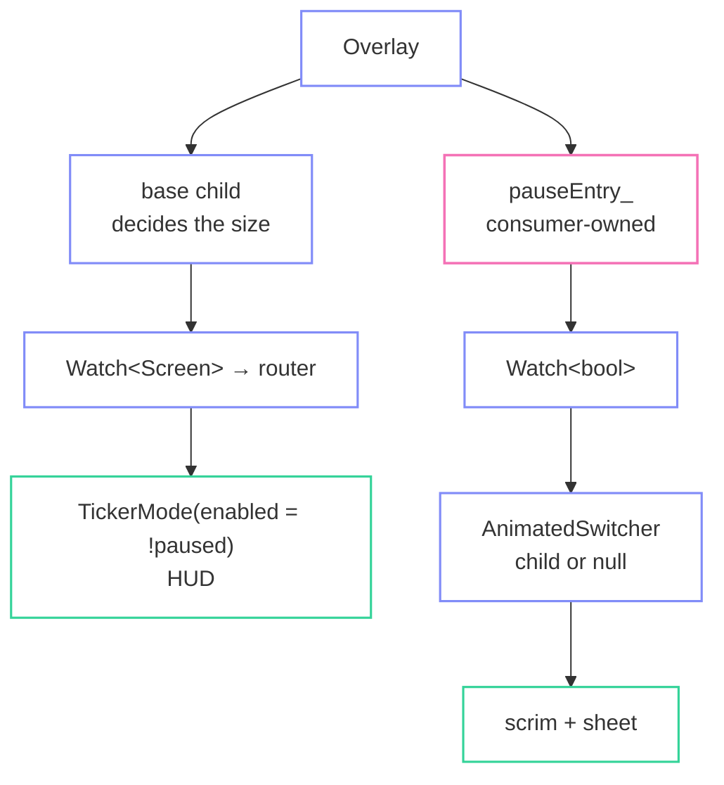

import { Aside, LinkCard } from '@astrojs/starlight/components';

The pause panel is drawn over live gameplay, has to animate **out** as well as in,
and is reused verbatim as the result screen. All three fall out of one entry and
one `AnimatedSwitcher`.

## The entry is yours

```cpp title="docs/demo/src/app/app.hh"
/// Consumer-owned, as every overlay entry is. Inserted while the gameplay
/// screen is up; its own content decides whether anything is visible.
fltr::OverlayEntry pauseEntry_;
fltr::OverlayState* overlay_ = nullptr;
```

```cpp title="docs/demo/src/app/app.cc"
App::App(const Options& options)
    : options_(options),
      clock_(options.smoke ? 1.0f / 60.0f : 0.0f),
      pauseEntry_([this](fltr::BuildContext& context) { return pauseOverlay(*this, context); }) {
  formatMaxFps();
}
```

The entry holds a builder and is owned by `App`, not by any widget. That is fltr's
rule for everything a widget refers to by pointer — `ScrollController`,
`FocusNode`, `WidgetStatesController`, `AnchorLink`, and this.

## Finding the overlay

`Overlay::of(context)` is an **ambient read**, and ambient reads only happen during
a build. But inserting an entry is something a *callback* does, long after that
build ended.

```cpp title="docs/demo/src/ui/root.cc"
                      .builder = [&app](BuildContext& context, const Screen& screen) -> WidgetRef {
                        // The overlay is found here, on the way down, and kept
                        // for the callbacks that will insert into it later.
                        app.bindOverlay(Overlay::of(context));
                        ...
                      },
```

```cpp title="docs/demo/src/app/app.cc"
void App::bindOverlay(fltr::OverlayState* overlay) noexcept { overlay_ = overlay; }

void App::goTo(Screen screen) {
  if (screen_.value() == screen) return;

  const bool leavingPlay = screen_.value() == Screen::Playing;
  screen_.set(screen);

  if (screen == Screen::Playing) {
    if (overlay_ != nullptr && !pauseEntry_.inserted()) overlay_->insert(pauseEntry_);
  } else if (leavingPlay) {
    setPaused(false);
    pauseEntry_.remove();
  }
}
```

Read it during the build, keep the pointer, use it from a callback. That split is
worth internalising — it is the same shape any "open a dialog from a button" flow
takes.

<Aside type="tip" title="The entry is inserted for the whole gameplay screen">
Not when the game is paused. It is inserted on entering `Playing` and removed on
leaving, and **its own content decides whether anything is visible**.

That is what makes the exit animation possible: if insertion were tied to the
pause flag, un-pausing would remove the entry and the panel would vanish rather
than fade.
</Aside>

## The null child

```cpp title="docs/demo/src/ui/screens/pause.cc"
WidgetRef pauseOverlay(App& app, BuildContext&) {
  return Watch<bool>::make({
      .value = &app.paused(),
      .builder = [&app](BuildContext& inner, const bool& paused) -> WidgetRef {
        const Theme& current = ThemeScope::of(inner);
        const Outcome outcome = app.session().outcome.value();

        // A null child is a child: the switcher animates whatever is there out
        // and leaves nothing behind. That is the M14 machinery -- the outgoing
        // element stays mounted and ticking, and is never rebuilt, until its
        // animation reaches zero.
        return AnimatedSwitcher::make({
            .child = paused ? panelFor(app, current, outcome) : WidgetRef{},
            .animation = {.duration = 0.18f, .curve = fltr::Curves::easeOut},
            .transition = &slidePresence,
        });
      },
  });
}
```

That ternary is the whole dismissal. `WidgetRef{}` is a **child**, and the switcher
treats it as one: whatever is there animates out and nothing takes its place.

The outgoing subtree stays mounted, keeps its `State`, keeps ticking, is never
rebuilt, and is discarded once its presence reaches zero. It is also inert — it
takes no pointer input and nothing in it can hold the focus, so you cannot click
"Resume" on a panel that is halfway gone.

## The panel

```cpp title="docs/demo/src/ui/screens/pause.cc"
WidgetRef panelFor(App& app, const Theme& theme, Outcome outcome) {
  const bool over = outcome != Outcome::Flying;

  return Stack::make({
      .fit = StackFit::Expand,
      .children =
          {
              // The scrim is part of the panel rather than a separate entry, so
              // it fades with it: one subtree in, one subtree out.
              DecoratedBox::make({.decoration = scrimDecoration(theme)}),
              sheet(Key::of("pause.sheet"), theme, 420.0f,
                    panel(theme, EdgeInsets::all(theme.unit * 0.75f),
                          Column::make({ ... }))),
          },
  });
}
```

The scrim is **inside** the animated subtree, not a second overlay entry. One
subtree in, one subtree out, one animation — and the scrim's fade is automatically
in step with the panel's.

```cpp title="docs/demo/src/ui/theme.cc"
BoxDecoration scrimDecoration(const Theme& theme) {
  return BoxDecoration{.color = theme.background.withAlpha(0xcc)};
}
```

`StackFit::Expand` makes the scrim fill the overlay, which fills the base child —
so it covers the whole HUD without anyone computing a size.

## One panel, three meanings

```cpp title="docs/demo/src/ui/screens/pause.cc"
std::string_view headlineFor(Outcome outcome) {
  switch (outcome) {
    case Outcome::Cleared: return "Field cleared";
    case Outcome::Destroyed: return "Hull breached";
    default: return "Paused";
  }
}
```

```cpp title="docs/demo/src/ui/screens/pause.cc"
                                      menuButton(theme,
                                                 {
                                                     .key = Key::of("pause.resume"),
                                                     .label = over ? "Fly again" : "Resume",
                                                     .trailing = "ESC",
                                                     .onPressed =
                                                         [&app] {
                                                           if (app.session().outcome.value() !=
                                                               Outcome::Flying) {
                                                             app.startLevel(
                                                                 app.session().level());
                                                           } else {
                                                             app.setPaused(false);
                                                           }
                                                         },
                                                     .autofocus = true,
                                                 }),
```

Pause panel, "field cleared" panel and "hull breached" panel are the same widget
with a different headline and a different verb on one button. Nothing else changes.

## The Escape key

```cpp title="docs/demo/src/app/app.cc"
void App::togglePause() {
  if (screen_.value() != Screen::Playing) {
    // Escape outside gameplay means "back", not "pause".
    goTo(screen_.value() == Screen::MainMenu ? Screen::MainMenu : Screen::MainMenu);
    return;
  }
  // A finished run cannot be un-paused: its panel is the result screen.
  if (session_.outcome.value() != Outcome::Flying) return;
  setPaused(!paused_.value());
}
```

One registration at the root, meaning resolved from app state. A finished run's
panel is the result screen, so Escape does not dismiss it.

## Stopping the world behind it

```cpp title="docs/demo/src/ui/root.cc"
                                  return TickerMode::make({
                                      // Animations in a paused gameplay screen
                                      // stop entirely: a muted ticker holds no
                                      // subscription and consumes no time.
                                      .enabled = !(screen == Screen::Playing && paused),
                                      .child = screenFor(app, ThemeScope::of(inner), screen),
                                  });
```

<Aside type="tip" title="Muted means unsubscribed, not skipped">
A muted ticker holds **no subscription at all**. It is not called and told to do
nothing — it is not called. `activeTickerCount()` drops, and the demo's debug
readout shows it drop.

And because a ticker carries a per-frame delta rather than an absolute clock, a
muted animation has no elapsed time to reconcile when it comes back. It resumes
exactly where it stopped.
</Aside>

The `TickerMode` wraps the **gameplay screen**, not the overlay. Overlay entries are
children of the `RenderOverlay`, which sits above the router, so the pause panel's
own entrance animation is unaffected by the mode that stopped the HUD's.

## The three layers, in order



The base child alone decides the overlay's size — an overlay must never change the
layout of what it overlays, however large an entry is. Entries paint after the
base and, because hit testing walks children in reverse, are tested **before** it,
which is what makes the scrim swallow clicks aimed at the HUD.

<Aside type="tip" title="What this step proved">
Exit animations work, and they cost nothing structurally — no "keep-alive" flag,
no dismissal callback, no second tree. The `WidgetRef` carrying its own type and
key is what made retaining an outgoing subtree fall out of reconciliation instead
of being bolted onto it.

The finding is small: `Overlay::of` being a build-only read means an app that opens
panels from callbacks has to stash the `OverlayState*` during a build. Three lines
in this demo, and not obvious the first time.
</Aside>

<LinkCard
  title="Next: animated components"
  description="The cheap path and the expensive one, measured side by side."
  href="/fltr/walkthrough/animated-components/"
/>
