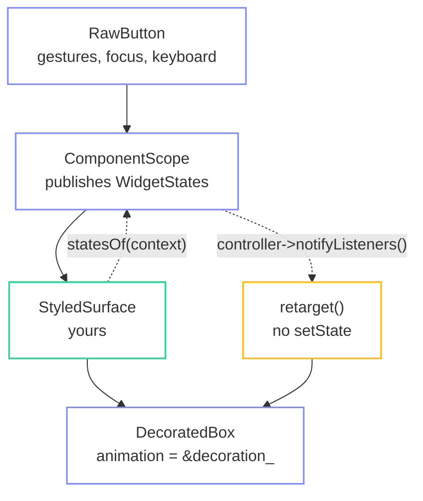

import { Aside, LinkCard, Steps, Tabs, TabItem } from '@astrojs/starlight/components';

fltr's components own behaviour and **nothing** about how it looks. What flows
between the component and your visuals is a bitset. This step builds the piece
that consumes it, and every control in the rest of the demo is built on it.

## The bargain



## `SurfaceStyle`

The mapping from a bitset to pixels, written once.

```cpp title="docs/demo/src/ui/widgets/styled_surface.hh"
/// One decoration per interaction state.
struct SurfaceStyle {
  fltr::BoxDecoration rest;
  fltr::BoxDecoration hovered;
  fltr::BoxDecoration pressed;
  fltr::BoxDecoration selected;
  fltr::BoxDecoration disabled;
  /// Applied on top of whichever of the above won, as a border only.
  fltr::Color focusRing = fltr::Color::transparent();
  /// How far the surface shrinks while pressed. 1 adds no transform at all.
  float pressScale = 1.0f;
  float duration = 0.12f;

  friend constexpr bool operator==(const SurfaceStyle&, const SurfaceStyle&) noexcept = default;
};
```

```cpp title="docs/demo/src/ui/widgets/styled_surface.cc"
BoxDecoration resolveSurface(const SurfaceStyle& style, WidgetStates states) noexcept {
  BoxDecoration decoration = style.rest;
  if (states.has(WidgetState::Selected)) decoration = style.selected;
  if (states.has(WidgetState::Hovered)) decoration = style.hovered;
  if (states.has(WidgetState::Pressed)) decoration = style.pressed;
  if (states.has(WidgetState::Disabled)) decoration = style.disabled;

  if (states.has(WidgetState::Focused) && !states.has(WidgetState::Disabled) &&
      style.focusRing.a > 0 && focusVisible(style)) {
    decoration.borderColor = style.focusRing;
    decoration.borderWidth = std::max(decoration.borderWidth, 1.0f);
  }
  return decoration;
}
```

Most specific last. Focus composes rather than replaces: it recolours the border
of whichever surface won, so a focused and hovered control still looks hovered.

`focusVisible` is the demo's own `:focus-visible`. Something is always focused --
every screen autofocuses a control, so Tab and Enter have somewhere to start --
but a window that has only ever seen a mouse should not be wearing keyboard
affordances. The input layer publishes which device is driving, the theme carries
it, and the ring is shown only while it says keyboard:

```cpp title="docs/demo/src/ui/widgets/styled_surface.cc"
bool focusVisible(const SurfaceStyle& style) noexcept {
  return style.keyboardMode == nullptr || style.keyboardMode->value();
}
```

```cpp title="docs/demo/src/platform/input.cc"
if (moved || IsMouseButtonPressed(MOUSE_BUTTON_LEFT)) keyboardMode_.set(false);
// ... and in pumpKeys:
keyboardMode_.set(true);
```

Nothing rebuilds when it flips: `StyledSurfaceState` subscribes to the same
observable it subscribes to the component's states with, and retargets.

Three presets cover the whole demo:

```cpp title="docs/demo/src/ui/widgets/styled_surface.cc"
SurfaceStyle buttonStyle(const Theme& theme) {
  const BorderRadius radius = BorderRadius::all(theme.radius);
  return SurfaceStyle{
      .rest = {theme.surface, radius, theme.border, theme.hairline},
      .hovered = {theme.surfaceRaised, radius, theme.borderStrong, theme.hairline},
      .pressed = {theme.accentSoft, radius, theme.accent, theme.hairline},
      .selected = {theme.accentSoft, radius, theme.accent, theme.hairline},
      .disabled = {theme.background, radius, theme.border, theme.hairline},
      .focusRing = theme.accent,
  };
}
```

Note what changes between `rest` and `hovered`: the fill moves one step and the
border moves one step. Hairlines and small radii, contrast carried by the border.

## `StyledSurface`

```cpp title="docs/demo/src/ui/widgets/styled_surface.hh"
class StyledSurfaceState final : public fltr::State<StyledSurface> {
public:
  void initState() override;
  void didUpdateWidget(const StyledSurface& previous) override;
  void dispose() override;
  fltr::WidgetRef build(fltr::BuildContext& context) override;

private:
  /// The whole point of this class: a state change retargets an interpolation
  /// that a render object is already observing. No `setState`, so hovering a
  /// button rebuilds nothing at all -- it repaints one node.
  void onStatesChanged();
  void retarget();

  /// One driver for both properties: they are retargeted from the same callback
  /// at the same instant, so sharing it keeps them exactly in step.
  fltr::AnimationDriver driver_;
  fltr::AnimatedValue<fltr::BoxDecoration> decoration_{driver_, {}};
  fltr::AnimatedValue<fltr::Transform2D> scale_{driver_, {}};
  fltr::Subscription states_;
  fltr::WidgetStatesController* controller_ = nullptr;
};
```

### The subscription

```cpp title="docs/demo/src/ui/widgets/styled_surface.cc"
WidgetRef StyledSurfaceState::build(BuildContext& context) {
  // Reading the component's states subscribes this element to the *scope*, not
  // to the controller: the scope only changes when a different component wraps
  // us, which is almost never.
  WidgetStatesController* controller = ComponentScope::statesOf(context);
  if (controller != controller_) {
    controller_ = controller;
    states_.detach();
    if (controller_ != nullptr) {
      fltr::subscribeMember<StyledSurfaceState, &StyledSurfaceState::onStatesChanged>(
          *controller_, states_, this);
    }
    retarget();
  }
  ...
}
```

That distinction is the trick. `statesOf` creates an ambient dependency on the
scope, which effectively never changes, and the subscription to the controller is
one we make explicitly, so we choose where it goes.

### The retarget

```cpp title="docs/demo/src/ui/widgets/styled_surface.cc"
void StyledSurfaceState::retarget() {
  const WidgetStates states = controller_ != nullptr ? controller_->value() : WidgetStates{};

  const BoxDecoration decoration = resolveSurface(widget().style(), states);
  if (!(decoration == decoration_.value())) decoration_.retarget(decoration);

  const float scale = states.has(WidgetState::Pressed) ? widget().style().pressScale : 1.0f;
  const fltr::Transform2D transform = fltr::Transform2D::scaling(scale, scale);
  if (!(transform == scale_.value())) scale_.retarget(transform);
}

void StyledSurfaceState::onStatesChanged() { retarget(); }
```

**There is no `setState` anywhere in this file.** The state change re-bases an
interpolation that a render object is already subscribed to.

`retarget` re-bases from the value *currently on screen*, so moving the pointer
in and out of a button repeatedly is continuous and accumulates no error.

### The tree it builds

```cpp title="docs/demo/src/ui/widgets/styled_surface.cc"
  WidgetRef surface = DecoratedBox::make({.animation = &decoration_, .child = widget().child()});

  // The transform is a paint-only property, so a press animates by repainting
  // one render object -- the same bargain the decoration makes. It is omitted
  // entirely when the style does not ask for it, rather than left as an
  // identity node nobody needs.
  if (widget().style().pressScale != 1.0f) {
    surface = fltr::Transform::make({
        .animation = &scale_,
        .origin = fltr::Alignment::center(),
        .child = surface,
    });
  }
  return surface;
```

## The two paths, side by side

<Tabs>
  <TabItem label="StatesBuilder: a rebuild per hover">

```cpp
StatesBuilder::make({
  .builder = [](BuildContext&, WidgetStates states) -> WidgetRef {
    return DecoratedBox::make({
      .decoration = states.has(WidgetState::Hovered) ? hovered : rest,
      .child = label(),
    });
  },
})
```

Simple, and matches Flutter's idiom. Every pointer enter and exit rebuilds this
subtree, then lays it out, then paints it.

Correct when the visual's structure changes with the state: a checkmark that
appears, a spinner replacing a label.

  </TabItem>
  <TabItem label="StyledSurface: zero rebuilds">

```cpp
StyledSurface::make({.style = buttonStyle(theme), .child = label()})
```

Hovering rebuilds **nothing**. `buildCount()` does not move; `stats.layouts` does
not move; one render object repaints.

Correct when only the painting changes with the state, which is nearly always.

  </TabItem>
</Tabs>

## `menuButton`

Behaviour and appearance, wired together and still not aware of each other:

```cpp title="docs/demo/src/ui/widgets/menu_button.cc"
WidgetRef pressable(const Theme& theme, const MenuButtonSpec& spec, WidgetRef body) {
  SurfaceStyle style = spec.selected ? listItemStyle(theme) : buttonStyle(theme);
  style.pressScale = 0.985f;

  return RawButton::make({
      .key = spec.key,
      .onPressed = spec.onPressed,
      .enabled = spec.enabled,
      .selected = spec.selected,
      .autofocus = spec.autofocus,
      .child = StyledSurface::make({.style = style, .child = body}),
  });
}
```

```cpp title="docs/demo/src/ui/widgets/menu_button.cc"
WidgetRef menuButton(const Theme& theme, const MenuButtonSpec& spec) {
  TextStyle trailing = labelStyle(theme);
  if (!spec.enabled) trailing.color = theme.textFaint;

  return pressable(theme, spec,
               Padding::make({
                   .padding = EdgeInsets::symmetric(theme.unit * 1.75f, theme.unit * 1.25f),
                   .child = Row::make({
                       .children =
                           {
                               Text::make({.text = spec.label, .style = labelFor(theme, spec)}),
                               spacer(),
                               Text::make({.text = spec.trailing, .style = trailing}),
                           },
                   }),
               }));
}
```

### What about the label?

```cpp title="docs/demo/src/ui/widgets/menu_button.cc"
/// Text has no state-driven colour: `Text` takes a fixed `TextStyle` and there
/// is no animated text colour in fltr. Everything the label needs is known at
/// build time anyway -- enabled and selected are configuration, not interaction
/// -- so the label never has to rebuild for hover or press.
TextStyle labelFor(const Theme& theme, const MenuButtonSpec& spec) {
  TextStyle style = bodyStyle(theme);
  if (!spec.enabled) {
    style.color = theme.textFaint;
  } else if (spec.selected) {
    style.color = theme.accent;
  }
  return style;
}
```

<Aside type="tip" title="The division that makes this work">
Let the surface carry hover and press: interaction, animated, zero rebuilds. Let
the label carry enabled and selected: configuration, known at build time, no
animation needed.

Nothing rebuilds on either.
</Aside>

<Aside type="caution" title="The limitation is real, though">
There is no animated text colour and no ambient default text style, so a label
genuinely *cannot* follow hover without a rebuild. The division above is a good
design that happens to also be the only one available. On the
[gaps list](/fltr/project/gaps-and-rework/).
</Aside>

## The padding numbers

```cpp
EdgeInsets::symmetric(theme.unit * 1.75f, theme.unit * 1.25f)   // 14 × 10
```

Slim rows: more horizontal than vertical padding, a 6px radius, a 1px border, and
a 0.985 press scale that is felt more than seen. Nothing in the demo has a shadow
because nothing in `BoxDecoration` can.

<Aside type="note" title="The component layer is the best idea in the framework">
Splitting behaviour from appearance at the `WidgetStates` boundary meant one
130-line file gave every control in the demo animated hover, press, focus and
disabled states, for one repaint per frame of animation and no rebuilds.

The smoke test asserts `buildCount()` stays put while hovering.
</Aside>

<LinkCard
  title="Guide: styling components"
  description="Both consumption paths, the resolution order, and the fraction adapter."
  href="/fltr/guides/styling-components/"
/>

<LinkCard
  title="Next: the router"
  description="AnimatedSwitcher with a custom slide transition, in and out."
  href="/fltr/walkthrough/router/"
/>
