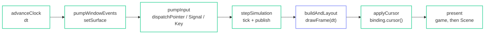

import { Aside, LinkCard, Steps } from '@astrojs/starlight/components';

fltr is a library your loop calls, not a framework that calls your loop. This is
the shape, and each step is a separate function because the ordering between them
is load-bearing rather than incidental.

## `app/loop.hh`

```cpp title="docs/demo/src/app/loop.hh"
#pragma once

#include "fltr/paint/display_list.hpp"

namespace demo {

class App;

/// The frame, as named steps. Each one is a separate function on purpose: this
/// is the shape of a game loop that drives fltr, and the ordering constraints
/// between the steps are the whole subject of the "driving from a game loop"
/// guide.
///
/// Input goes in as it arrives and is unrelated to the frame; the frame is one
/// call to `drawFrame`, and what comes out of it is a `Scene` to submit.

float advanceClock(App& app);
void pumpWindowEvents(App& app);
void pumpInput(App& app);
void stepSimulation(App& app, float dt);
fltr::Scene buildAndLayout(App& app, float dt);
void applyCursor(App& app);
void present(App& app, const fltr::Scene& scene);

/// Runs all of the above, in order, and hands back what was submitted.
fltr::Scene runFrame(App& app);

}  // namespace demo
```

## The frame

```cpp title="docs/demo/src/app/loop.cc"
Scene runFrame(App& app) {
  const float dt = advanceClock(app);
  pumpWindowEvents(app);
  pumpInput(app);
  stepSimulation(app, dt);
  const Scene scene = buildAndLayout(app, dt);
  applyCursor(app);
  app.refreshDebugText();
  present(app, scene);
  return scene;
}
```

## The steps



### `advanceClock`

```cpp title="docs/demo/src/app/loop.cc"
float advanceClock(App& app) { return app.clock().advance(); }
```

### `pumpWindowEvents`

```cpp title="docs/demo/src/app/loop.cc"
void pumpWindowEvents(App& app) {
  // Pushing the same size again is a no-op, so this is unconditional.
  const fltr::Size surface = app.window().surface();
  app.binding().setSurface(surface);
  app.session().setBounds(surface);
}
```

Unconditional on purpose. `setSurface` compares before it invalidates, so a
frame in which the window did not move costs one `Size` comparison.

### `pumpInput`

```cpp title="docs/demo/src/app/loop.cc"
void pumpInput(App& app) {
  // A menu takes the keyboard away from the ship without either side knowing
  // about the other: the UI answers "did I consume this", and what is left is
  // the game's.
  app.input().setGameHasFocus(app.gameHasFocus());
  app.input().pump(app.binding());
}
```

<Aside type="note" title="Input is not part of the frame">
`dispatchPointer`, `dispatchSignal` and `dispatchKey` are all callable at any
time. They are here because this loop polls, not because fltr requires it. A
platform with a real event queue would dispatch from its callback and never touch
this step.
</Aside>

### `stepSimulation`

```cpp title="docs/demo/src/app/loop.cc"
void stepSimulation(App& app, float dt) {
  app.session().tick(app.shipInput(), dt);
  // One push per frame of everything the UI might read. Values that did not
  // change notify nobody, so this is cheap even though it is unconditional.
  app.session().publish();
}
```

**Before** `buildAndLayout`, so a value the game pushed this frame is visible to
the build that follows it. Pushing after would show it one frame late.

### `buildAndLayout`

```cpp title="docs/demo/src/app/loop.cc"
Scene buildAndLayout(App& app, float dt) {
  // The only call into the framework's frame. Animations advance, then what is
  // dirty is built, then what that made dirty is laid out and painted.
  return app.binding().drawFrame(dt);
}
```

One line, and it is the entire framework-facing surface of the loop. Everything
else on this page is yours.

### `applyCursor`

```cpp title="docs/demo/src/app/loop.cc"
void applyCursor(App& app) { app.window().applyCursor(app.binding().cursor()); }
```

**After** `drawFrame`, because hover is resolved inside it. Reading the cursor
before would apply last frame's answer.

### `present`

```cpp title="docs/demo/src/app/loop.cc"
void present(App& app, const Scene& scene) {
  BeginDrawing();
  ClearBackground(Color{0x0a, 0x0a, 0x0c, 0xff});
  if (app.screen().value() == Screen::Playing) drawField(app.session(), scene.surface);
  app.backend().submit(scene);
  EndDrawing();
}
```

The game and the UI are drawn by different code into the same framebuffer. That is
the whole integration.

```cpp title="docs/demo/src/app/loop.cc"
/// The game is drawn by raylib directly; only the UI goes through fltr. Keeping
/// them separate is the point -- fltr is a UI library embedded in a renderer,
/// not a renderer.
void drawField(const Session& session, fltr::Size surface) {
  const Field& field = session.field();

  for (const Asteroid& rock : field.asteroids()) {
    const int sides = 5 + rock.tier;
    DrawPolyLinesEx(Vector2{rock.position.dx, rock.position.dy}, sides, rock.radius,
                    rock.angle * 57.2957795f, 1.5f, Color{0x8b, 0x8b, 0x99, 0xff});
  }

  for (const Bullet& bullet : field.bullets()) {
    DrawCircleV(Vector2{bullet.position.dx, bullet.position.dy}, 2.0f,
                Color{0x6e, 0x9b, 0xff, 0xff});
  }

  const Ship& ship = session.ship();
  if (ship.alive()) {
    const float heading = ship.heading() * 57.2957795f;
    DrawPolyLinesEx(Vector2{ship.position().dx, ship.position().dy}, 3, Ship::kRadius, heading,
                    2.0f, Color{0xec, 0xec, 0xef, 0xff});
    if (ship.thrusting()) {
      const Offset back = ship.position() -
                          Offset{std::cos(ship.heading()), std::sin(ship.heading())} *
                              (Ship::kRadius + 6.0f);
      DrawCircleV(Vector2{back.dx, back.dy}, 3.0f, Color{0xff, 0x6b, 0x6b, 0xff});
    }
  }
}
```

## What the ordering actually buys

<Steps>

1. **Clock before everything** — `dt` is one number, measured once, and every
   consumer of it gets the same value.

2. **Surface before input** — a resize that arrived this frame is applied before a
   pointer position is interpreted against the old layout.

3. **Input before simulation** — the ship acts on this frame's keys, not last
   frame's.

4. **Simulation before build** — a value pushed into an `Observable<T>` is read by
   the build that follows it, so the HUD is never a frame behind.

5. **Cursor after build** — hover is resolved inside `drawFrame`.

6. **Present last** — the game is drawn under the UI, into the same framebuffer.

</Steps>

<Aside type="tip" title="What this step proved">
The framework does not want to own your loop, and it shows: seven steps, one of
which is a call into fltr. The other six are things a game already does.

The cost, recorded honestly: nothing checks this ordering for you. Calling
`applyCursor` before `drawFrame` compiles, runs, and is subtly wrong.
</Aside>

<LinkCard
  title="Guide: driving from a game loop"
  description="The same material without the demo around it, including what to assert."
  href="/fltr/guides/game-loop/"
/>

<LinkCard
  title="Next: the backend"
  description="Every PaintOp, three state stacks, and the one thing raylib cannot express."
  href="/fltr/walkthrough/backend/"
/>
